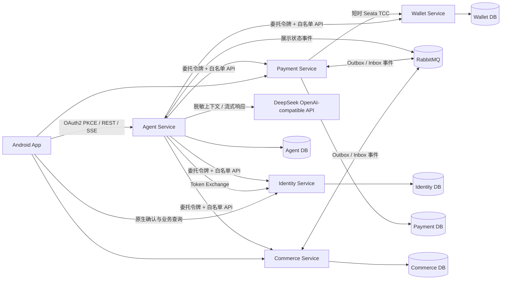
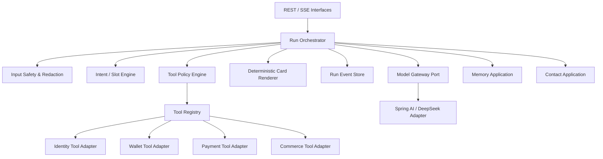
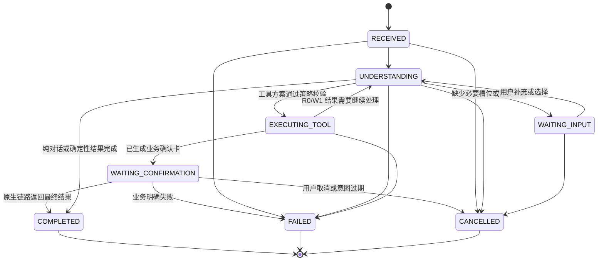
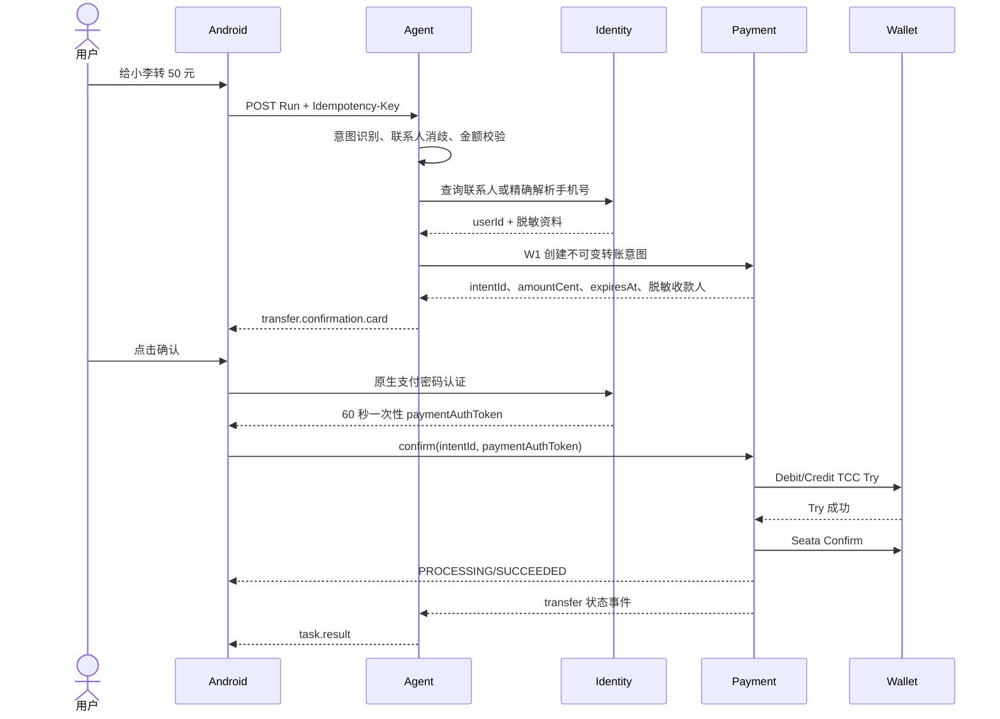
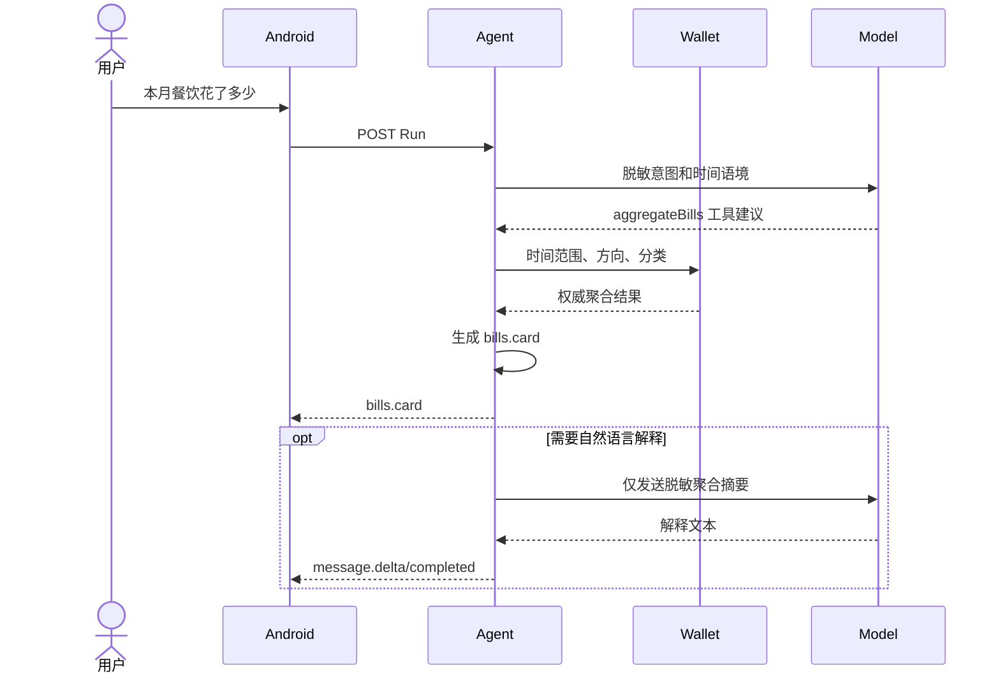
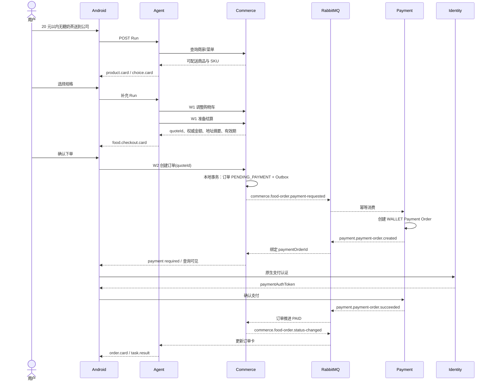
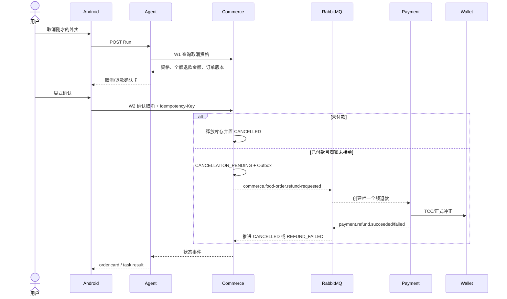
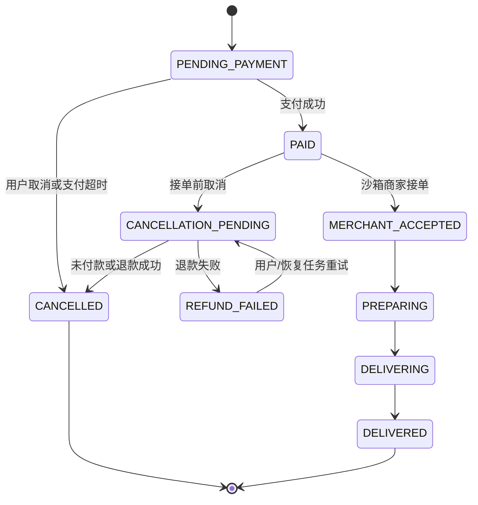
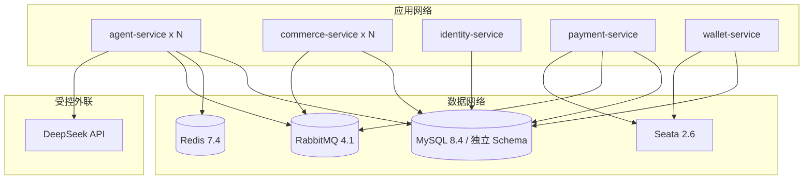

# MiniPay AI 智能体系统分析与设计 v1.0

| 属性 | 内容 |
|---|---|
| 文档状态 | 定稿设计，进入编码前评审 |
| 目标版本 | Android 沙箱 MVP（P0） |
| 编写日期 | 2026-08-08 |
| 输入文档 | `docs/MiniPay-AI-Agent-PRD-v1.0.md` |
| 适用服务 | Agent、Identity、Payment、Wallet、Commerce、Android |

## 1. 文档目的

本文给出 MiniPay Android 消费者端 AI 智能体的可实施系统设计，覆盖：

- 中文文字对话、会话管理、流式响应与结构化卡片；
- 站内转账、钱包余额与账单分析；
- 沙箱外卖推荐、购物车、结算、钱包支付、履约、取消与全额退款；
- 显式长期记忆、联系人别名与常用地址引用；
- 模型接入、工具编排、用户授权、数据一致性、隐私、部署与可观测性。

本文不替代 Payment、Wallet、Identity 的既有领域设计。资金和业务状态仍以业务服务为准，Agent 只负责理解、补槽、调用白名单工具和生成确定性 UI 事件。

## 2. 设计结论

### 2.1 核心原则

1. **模型不持有业务真相**：金额、余额、价格、库存、订单和支付状态只能来自权威工具结果。
2. **准备与执行分离**：Agent 可执行 R0 查询和 W1 意图准备；W2 交易动作只能由 Android 原生页面显式确认。
3. **展示与执行分离**：SSE 重放只恢复展示事件，不能重新调用工具或创建业务单。
4. **数据所有者单一**：Identity、Payment、Wallet、Commerce、Agent 各自独占数据库，禁止跨库访问。
5. **长流程最终一致**：外卖与支付使用本地事务、Outbox/Inbox 和幂等 Saga；站内资金转移继续使用 Wallet TCC。
6. **最小模型上下文**：完整手机号、地址、余额明细、凭据、Token 和原始工具结果不发送给模型。
7. **模型可替换**：应用层依赖 `ModelGateway` 端口，不依赖 DeepSeek 专有业务语义。

### 2.2 相对当前实现的关键变化

当前 `agent-service` 已承载普通私聊、群聊和转账消息展示，`chat_*` 表不是 AI 专属数据。为避免破坏既有社交聊天，AI 会话使用新的 `ai_*` 聚合，不复用或改义 `chat_conversation`、`chat_message`。

当前 `commerce-service` 已进入 Maven Reactor 和 Compose，但只有启动类及 Outbox/Inbox 技术表。P0 将在该服务内新增沙箱外卖领域，不创建新的商家后台服务。

当前 `agent-api-v1.yaml` 只定义了单个 POST SSE 草案。目标接口调整为“创建 Run”和“订阅事件”分离，以支持幂等、断线重连和运行恢复。

## 3. 范围与非目标

### 3.1 P0 范围

- Android、中文、文字输入；
- DeepSeek OpenAI-compatible 云端接口，默认模型 `deepseek-v4-flash`；
- 站内联系人或完整手机号精确解析转账；
- 钱包余额、账单列表、筛选和聚合分析；
- 沙箱商家、菜单、地址、优惠、库存、外卖订单和模拟配送；
- 钱包余额付款；
- 未接单取消、符合条件的全额退款；
- 用户明确授权、可查看修改删除的结构化长期记忆；
- 模型故障时的确定性快捷入口和传统业务页。

### 3.2 非目标

- 真实资金、真实商家、真实配送平台；
- 自动付款、免确认付款、定时转账；
- 模糊搜索全平台用户；
- 充值、提现代办；
- 部分退款、复杂售后、商家运营后台；
- 向量数据库、通用 RAG、MCP、LangGraph 或多智能体自主协作；
- 语音输入、主动提醒和真实外卖平台接入。

## 4. 技术选型

| 层面 | 选型 | 说明 |
|---|---|---|
| 运行时 | Java 21 | 与仓库一致，启用虚拟线程，不使用预览特性 |
| Web/API | Spring Boot 3.5.9、Spring MVC | 延续现有服务模型；公共 REST 与 SSE 均由 MVC 提供 |
| 模型抽象 | Spring AI 1.1.8 | 与 Spring Boot 3.5.x 兼容；使用可替换 `ChatModel`/`ChatClient` 抽象 |
| 模型适配 | `spring-ai-starter-model-openai` | 通过 OpenAI-compatible 协议接入 DeepSeek，不引用供应商专属 DTO |
| 上游流式 | Spring WebFlux `WebClient` | 仅用于模型流式 HTTP；不把整个服务改成 WebFlux |
| 下游 SSE | Spring MVC `SseEmitter` | 支持 Android SSE、心跳和主动完成连接 |
| 持久化 | MySQL 8.4、原生 MyBatis 3.0.5、Flyway | 业务真相与可恢复 Run 事件均落库 |
| 临时状态 | Redis 7.4 | 运行锁、取消标志、限流、短期缓存；不保存业务最终状态 |
| 可靠消息 | RabbitMQ 4.1、Outbox/Inbox | 支付、退款、订单和履约的至少一次事件投递 |
| 资金一致性 | Seata 2.6 TCC | 仅用于现有 Wallet 转账、钱包支付和冲正分支 |
| 身份认证 | OAuth 2.1/OIDC、JWT、Token Exchange | Android PKCE；Agent 使用短期用户委托令牌调用内部工具 |
| 可观测性 | Actuator、Micrometer、Prometheus、OpenTelemetry | 指标、日志、Trace 和业务恢复关联 |
| 测试 | JUnit 5、MockMvc、Testcontainers、ArchUnit | 单元、契约、集成、消息和架构测试 |

选择依据：

- Spring AI 1.1.x 对应 Spring Boot 3.5.x，避免升级到需要 Spring Boot 4 的 Spring AI 2.x。参见 [Spring AI 版本兼容说明](https://github.com/spring-projects/spring-ai)。
- Spring AI 的工具调用由应用执行，模型只提出调用请求，适合在策略引擎后实施白名单与人工确认。参见 [Spring AI Tool Calling](https://docs.spring.io/spring-ai/reference/api/tools.html)。
- Spring MVC 使用 `SseEmitter` 提供 SSE；流式模型调用所需的 reactive 依赖仅限出站适配器。参见 [Spring MVC 异步请求](https://docs.spring.io/spring-framework/reference/web/webmvc/mvc-ann-async.html)。
- DeepSeek 通过 OpenAI-compatible API 提供流式模型调用；应用仍通过 `ModelGateway` 隔离供应商，业务工具执行由本地策略引擎控制。

## 5. 总体架构

### 5.1 系统上下文



### 5.2 数据所有权

| 服务 | 独占数据 | 禁止行为 |
|---|---|---|
| Agent | AI 会话、消息、Run、SSE 事件、任务槽位、工具 Trace、显式记忆、联系人关系与别名 | 访问其他服务数据库；保存密码、Token、完整手机号或地址；执行 W2 |
| Identity | 用户身份、手机号 HMAC、支付密码摘要、一次性支付授权、委托令牌 | 保存余额或支付单；向 Agent 返回支付密码 |
| Payment | 转账意图、转账单、支付单、退款单、支付编排 | 直接修改 Wallet 余额或 Commerce 订单 |
| Wallet | 钱包、冻结、年度限额、账务事务、复式账本和账单 | 暴露任意余额修改接口；接受 AI 自报金额 |
| Commerce | 商家、菜单、SKU、库存、购物车、地址、报价、外卖订单和履约 | 修改 Payment 状态；写 Wallet 账本 |

### 5.3 Agent 内部结构



服务内部继续遵守 `interfaces -> application -> domain`，`infrastructure` 实现 application/domain 出站端口。Spring AI、HTTP、MyBatis、Redis 和 RabbitMQ 类型不得进入 domain。

## 6. Agent 运行与编排设计

### 6.1 Run 状态机



状态迁移必须使用乐观锁 `version`。`cancel` 只停止尚未完成的模型生成和工具编排，不撤销已经创建的转账意图、外卖订单、支付单或退款单。

### 6.2 一次运行的处理步骤

1. API 校验 JWT、会话所有权、`Idempotency-Key`、`clientMessageId` 和 `contextVersion`。
2. 输入安全层检测密码、验证码、Token、密钥和提示注入；命中高危凭据时拒绝处理，不保存原文。
3. 完整手机号由本地规则瞬时提取，直接调用 Identity 精确解析；持久化及模型文本仅保留 `[MOBILE_EXACT]` 占位符。
4. 在同一本地事务内创建 `agent_run`、脱敏后的 `ai_message` 和首个 `agent_run_event`。
5. Run Orchestrator 构建最小上下文并调用 Model Gateway。
6. 模型输出文本增量或工具调用建议。工具建议先经过注册表、Schema、权限、所有权、风险和幂等校验。
7. R0/W1 工具执行结果由确定性 Renderer 生成卡片；原始财务结果不回灌模型。
8. 每个展示事件先写 `agent_run_event`，提交成功后才推送 SSE。
9. W2 场景发出 `payment.required` 或确认卡并进入 `WAITING_CONFIRMATION`；Android 直接进入原生业务流程。
10. Agent 通过权威查询或业务事件收敛最终状态，写 `task.result` 和 `stream.completed`。

### 6.3 模型循环限制

- 单个 Run 最多 6 次模型/工具循环；超过后返回 `AGENT_STEP_LIMIT_EXCEEDED`。
- 单次模型调用默认 30 秒总超时，8 秒无任何增量则触发可恢复错误。
- R0 查询默认 3 秒超时，可对连接错误进行最多 1 次带抖动重试。
- W1 写入默认 5 秒超时，不直接重放；超时后使用幂等键查询已存在结果。
- W2 永不进入模型循环。
- 单个 Run 最多并行执行 3 个互不依赖的 R0 工具；W1 串行执行。
- 用户取消后设置 Redis 取消标志并中断上游流，但已提交的业务事实不回滚。

## 7. 模型上下文与提示策略

### 7.1 上下文组成

模型请求只包含：

- 版本化系统提示词；
- 最近有限轮脱敏对话摘要；
- 当前意图、已确认槽位和允许的下一步；
- 用户明确启用且与本任务相关的结构化记忆；
- 允许公开的商家、商品描述；
- 必要的脱敏聚合数据，例如“本月餐饮支出区间和笔数”。

模型请求不包含：

- Android Access Token、委托令牌、服务凭据、Cookie；
- 支付密码、验证码、支付授权令牌；
- 完整手机号、完整地址、身份证、银行卡号；
- 钱包余额原值、逐笔账单原文和账本分录；
- 任意内部 URL、SQL、消息主题、Trace 原始内容；
- 工具返回的未经清洗自由文本。

### 7.2 Prompt 版本管理

- Prompt 作为 Agent 配置资源随应用版本发布，使用 `promptVersion` 标识。
- `agent_run` 记录模型供应商、模型名、Prompt 版本和工具目录版本，不记录完整系统提示。
- 变更 Prompt 或工具描述必须通过固定语料回归和安全用例。
- 商家名、商品名、备注和工具错误均放入不可信数据区，不得拼接为系统指令。

### 7.3 模型输出处理

- 文本输出经过内容安全、长度和敏感信息过滤后才写事件。
- 工具名必须精确命中当前目录；模型构造的 URL、类名或任意函数名直接拒绝。
- 工具参数先反序列化到专用 DTO，再做 Bean Validation、枚举、金额、时段、分页和所有权校验。
- 模型不能提供 `amountCent` 的权威值；金额必须来自用户已确认槽位或 Commerce/Payment 权威资源。
- 余额、账单、转账、订单与支付结果使用 Renderer，不允许模型重新组织核心字段。

## 8. 工具目录与风险控制

### 8.1 风险等级

| 等级 | 含义 | 模型可建议 | Agent 可执行 | 用户确认 |
|---|---|---:|---:|---|
| R0 | 当前用户只读查询 | 是 | 是 | 用户当前提问即为本次查询授权 |
| W1 | 创建或修改可撤销草稿、准备不可变意图 | 是 | 是 | 结果必须以结构化卡片展示 |
| W2 | 改变业务状态或资金状态 | 否 | 否 | Android 原生页面显式确认后直调业务服务 |

### 8.2 P0 白名单

| 工具名 | 等级 | 数据所有者 | 核心约束 |
|---|---|---|---|
| `contact.list` | R0 | Agent | 只查当前用户联系人，游标分页，返回脱敏资料 |
| `recipient.resolveExactMobile` | R0 | Identity | 完整手机号请求内瞬时使用；统一未匹配响应；限流 |
| `wallet.getSummary` | R0 | Wallet | 当前用户；结果直接生成钱包卡 |
| `wallet.listBills` | R0 | Wallet | 最大 90 天、分页上限 50；明细不进模型 |
| `wallet.aggregateBills` | R0 | Wallet | 固定时间、方向和分类枚举；返回聚合 |
| `payment.prepareTransfer` | W1 | Payment | 金额为分；收款人已解析；不可变、有效期、幂等 |
| `commerce.searchMerchants` | R0 | Commerce | 配送范围、营业状态、品类、预算过滤 |
| `commerce.getMenu` | R0 | Commerce | 分页；仅可售菜单与 SKU |
| `commerce.updateCart` | W1 | Commerce | 单商家；SKU、规格、库存、数量和版本校验 |
| `commerce.prepareCheckout` | W1 | Commerce | Commerce 权威价格、配送费、优惠、库存和有效期 |
| `commerce.getOrder` | R0 | Commerce | 只查当前用户订单 |
| `commerce.prepareCancellation` | W1 | Commerce | 仅返回资格、预计退款额和确认卡，不取消 |
| `commerce.prepareRefund` | W1 | Commerce | 仅全额退款，引用原支付，不执行退款 |

以下动作不进入工具目录：确认转账、创建外卖订单、确认付款、取消已付款订单、创建退款、确认退款。它们由 Android 调用业务服务的公开 API，业务服务再次校验用户和资源状态。

### 8.3 工具执行审计

工具 Trace 只记录 `runId`、工具名、风险等级、Schema 版本、参数摘要哈希、结果摘要哈希、结果码、耗时、目标服务和调用时间。禁止记录完整参数、完整响应、手机号、地址、Authorization 或支付授权。

## 9. 公共 API 与 SSE 契约

所有成功响应直接返回资源；错误使用 RFC 9457 `application/problem+json`，包含稳定 `code` 和 `requestId`。

### 9.1 会话与运行 API

现有 `/api/v1/agent/conversations` 已用于普通私聊和群聊。为保持 Android 兼容，AI 资源使用独立的 `/api/v1/agent/ai` 子路径。

| 方法 | 路径 | 返回 | 说明 |
|---|---|---|---|
| POST | `/api/v1/agent/ai/conversations` | 201 | 创建 AI 会话 |
| GET | `/api/v1/agent/ai/conversations` | 200 | 游标分页，按更新时间倒序 |
| PATCH | `/api/v1/agent/ai/conversations/{conversationId}` | 200 | 重命名；使用版本号防并发覆盖 |
| DELETE | `/api/v1/agent/ai/conversations/{conversationId}` | 204 | 删除 AI 视图，不影响业务事实 |
| GET | `/api/v1/agent/ai/conversations/{conversationId}/messages` | 200 | 游标分页，最大 100 条 |
| POST | `/api/v1/agent/ai/conversations/{conversationId}/runs` | 202 | 创建幂等 Run |
| GET | `/api/v1/agent/ai/runs/{runId}` | 200 | 查询 Run 和当前业务引用 |
| GET | `/api/v1/agent/ai/runs/{runId}/events` | 200 SSE | 订阅或恢复事件 |
| POST | `/api/v1/agent/ai/runs/{runId}/cancel` | 200 | 幂等取消生成，不撤销业务事实 |

创建 Run 请求：

```json
{
  "clientMessageId": "0198f0d1-3d16-7c2a-a5d2-d872bf88a211",
  "message": "给小李转 50 元",
  "contextVersion": 7
}
```

请求头必须包含 `Idempotency-Key`。同一用户、会话和幂等键重复提交相同请求返回原 Run；载荷不同返回 `409 IDEMPOTENCY_KEY_REUSED`。

创建响应：

```json
{
  "runId": "0198f0d1-4250-72a8-bccb-d3acbd752616",
  "conversationId": "0198f0ce-a340-7ab1-b2cb-58c765adc50e",
  "status": "RECEIVED",
  "eventsUrl": "/api/v1/agent/ai/runs/0198f0d1-4250-72a8-bccb-d3acbd752616/events",
  "createdAt": "2026-08-08T08:00:00Z"
}
```

### 9.2 SSE 信封

HTTP 使用 `Content-Type: text/event-stream`。SSE `id` 等于持久化事件序号，`event` 等于 `eventType`，`data` 为下列 JSON：

```json
{
  "id": "42",
  "type": "transfer.confirmation.card",
  "version": 1,
  "conversationId": "0198f0ce-a340-7ab1-b2cb-58c765adc50e",
  "runId": "0198f0d1-4250-72a8-bccb-d3acbd752616",
  "occurredAt": "2026-08-08T08:00:01.125Z",
  "traceId": "9fbd0a6e3f4b5b23d5b16f5af82d3daa",
  "payload": {}
}
```

P0 事件类型：

| 类型 | 载荷用途 |
|---|---|
| `message.delta` | 安全过滤后的文本增量 |
| `message.completed` | 最终文本消息引用 |
| `tool.started` | 工具名、阶段和安全文案，不含参数 |
| `tool.completed` | 结果码和安全摘要 |
| `choice.card` | 联系人、商家、SKU、规格或地址候选 |
| `wallet.card` | Wallet 权威余额摘要 |
| `bills.card` | Wallet 权威账单列表或聚合 |
| `transfer.confirmation.card` | 不可变转账意图、脱敏收款人、金额和有效期 |
| `merchant.card` | 商家候选 |
| `product.card` | 商品、SKU 与规格 |
| `cart.card` | Commerce 权威购物车 |
| `food.checkout.card` | 权威报价、地址摘要、优惠、实付和有效期 |
| `order.card` | 外卖订单及履约状态 |
| `payment.required` | 原生付款所需业务引用和导航动作 |
| `task.result` | 权威最终结果引用 |
| `task.error` | 稳定错误码、可展示说明、是否可重试 |
| `security.error` | 敏感输入或越权调用被拦截 |
| `stream.completed` | 本次流已结束 |
| `heartbeat` | 15 秒心跳，无业务语义 |

### 9.3 重连语义

- 客户端用 `Last-Event-ID` 恢复；服务端仅返回大于该序号的持久化事件。
- 事件保留 24 小时。游标过旧返回 `410 AGENT_EVENT_CURSOR_EXPIRED`，客户端改用 Run 查询与消息历史恢复。
- 每个 Run 的事件序号单调递增，唯一约束为 `(run_id, sequence_no)`。
- 120 秒没有新业务事件时服务端完成当前 SSE；Run 可继续在后台执行，客户端可重新订阅。
- SSE 连接断开不改变 Run 状态，不触发工具重试。

### 9.4 卡片通则

每张卡包含 `cardType`、`cardVersion`、资源 ID、资源版本、显示数据、允许动作和过期时间。Android 只能执行服务端给出的枚举动作，例如 `SELECT_CONTACT`、`OPEN_TRANSFER_AUTH`、`CREATE_FOOD_ORDER`、`OPEN_PAYMENT_AUTH`、`CONFIRM_CANCELLATION`。

卡片不携带密码、授权令牌、完整手机号、完整地址或内部服务 URL。资源已过期或版本变化时，业务服务返回 `409 RESOURCE_VERSION_CHANGED`，Agent/Android 获取最新资源后重新确认。

### 9.5 长期记忆 API

| 方法 | 路径 | 说明 |
|---|---|---|
| GET | `/api/v1/agent/memory-settings` | 查询记忆总开关和类型开关 |
| PUT | `/api/v1/agent/memory-settings` | 幂等更新设置 |
| GET | `/api/v1/agent/memories` | 按类型游标分页 |
| POST | `/api/v1/agent/memories` | 用户点击“记住”后创建 |
| PATCH | `/api/v1/agent/memories/{memoryId}` | 修改展示值或引用 |
| DELETE | `/api/v1/agent/memories/{memoryId}` | 幂等删除 |
| DELETE | `/api/v1/agent/memories` | 二次确认后清空 AI 记忆 |

## 10. 内部授权与服务调用

### 10.1 委托令牌

Identity 在 `/oauth2/token` 支持 `urn:ietf:params:oauth:grant-type:token-exchange`。Agent 使用自身 OAuth Client 认证，并提交当前 Android Access Token 作为 `subject_token`，请求单一目标 audience、最小 scope、`purpose` 和 `runId`。

返回的短期 JWT 至少包含：

```json
{
  "iss": "https://identity.minipay.local",
  "sub": "consumer-user-id",
  "azp": "agent-service",
  "aud": ["wallet-internal"],
  "scope": "wallet.agent.summary",
  "purpose": "AGENT_WALLET_QUERY",
  "run_id": "agent-run-id",
  "device_id": "android-device-id",
  "jti": "unique-token-id",
  "exp": 1786176120
}
```

- 有效期默认 120 秒，最长 300 秒；不可刷新。
- 每个 audience 单独兑换，不能用 Wallet 令牌调用 Payment。
- 委托令牌只存在于请求内存，不写数据库、Redis、日志或 Trace。
- 下游校验 `iss`、签名、`aud`、`exp`、`azp`、scope、purpose、subject 和资源所有权。
- 模型适配器的网络客户端不得读取 SecurityContext 或令牌缓存。

### 10.2 最小内部接口

| 服务 | 接口 | 最小 scope | 用途 |
|---|---|---|---|
| Identity | `/internal/v1/agent/recipients/resolve-exact-mobile` | `identity.agent.recipient.resolve` | 完整手机号精确解析 |
| Wallet | `/internal/v1/agent/wallet-summary` | `wallet.agent.summary` | 余额摘要 |
| Wallet | `/internal/v1/agent/wallet-bills` | `wallet.agent.bills.read` | 分页账单 |
| Wallet | `/internal/v1/agent/wallet-bill-aggregations` | `wallet.agent.bills.aggregate` | 确定性聚合 |
| Payment | `/internal/v1/agent/transfer-intents` | `payment.agent.transfer.prepare` | 创建待确认转账意图 |
| Payment | `/internal/v1/agent/transfer-orders/{transferId}` | `payment.agent.transfer.read` | 原生确认后查询权威转账结果并回写会话 |
| Commerce | `/internal/v1/agent/merchants` | `commerce.agent.catalog.read` | 商家搜索 |
| Commerce | `/internal/v1/agent/merchants/{merchantId}/menu` | `commerce.agent.catalog.read` | 菜单与 SKU |
| Commerce | `/internal/v1/agent/carts/{merchantId}/items/{skuId}` | `commerce.agent.cart.write` | 购物车调整 |
| Commerce | `/internal/v1/agent/checkout-quotes` | `commerce.agent.checkout.prepare` | 权威结算报价 |
| Commerce | `/internal/v1/agent/orders/{orderId}` | `commerce.agent.order.read` | 订单状态 |
| Commerce | `/internal/v1/agent/orders/{orderId}/cancellation-preview` | `commerce.agent.cancel.prepare` | 取消/退款资格 |

内部 API 同样使用 `/internal/v1`、RFC 9457、分页、幂等键和版本字段。它们只服务 Agent，不替代 Android 的 W2 公开 API。

## 11. 数据模型

### 11.1 Agent 数据模型

所有新表通过 V6 及后续增量迁移创建，现有 V1～V5 不修改。

| 表 | 关键字段 | 约束与索引 |
|---|---|---|
| `ai_conversation` | `id`、`user_id`、`title`、`status`、`version`、`last_message_at`、`deleted_at` | PK UUIDv7；`(user_id, deleted_at, last_message_at)` |
| `ai_message` | `id`、`conversation_id`、`run_id`、`role`、`content_text`、`card_type`、`card_version`、`card_payload`、`sequence_no` | `(conversation_id, sequence_no)` 唯一；内容已脱敏 |
| `agent_run` | `id`、`conversation_id`、`user_id`、`client_message_id`、`idempotency_key_hash`、`request_hash`、`status`、`intent_type`、`business_ref_type/id`、`model_provider/name`、`prompt_version`、`tool_catalog_version`、`version`、时间字段 | `(user_id, conversation_id, idempotency_key_hash)` 唯一；`(user_id, client_message_id)` 唯一 |
| `agent_run_event` | `id`、`run_id`、`sequence_no`、`event_type`、`payload_version`、`payload`、`occurred_at`、`expires_at` | `(run_id, sequence_no)` 唯一；按 `expires_at` 清理 |
| `agent_task_state` | `run_id`、`task_type`、`state_version`、`slots_json`、`selected_resource_refs`、`updated_at` | PK `run_id`；只存脱敏槽位和资源 ID |
| `agent_tool_trace` | `id`、`run_id`、`tool_name`、`risk_level`、`schema_version`、`request_digest`、`result_digest`、`result_code`、`latency_ms`、`created_at` | `(run_id, created_at)`；不保存原始参数 |
| `memory_setting` | `user_id`、总开关、类型开关、`version` | PK `user_id` |
| `memory_item` | `id`、`user_id`、`memory_type`、`display_value`、`reference_type/id`、`status`、`consent_message_id`、时间字段 | `(user_id, memory_type, status)`；引用可失效 |
| `contact_relation` | `id`、`owner_user_id`、`contact_user_id`、`status`、时间字段 | `(owner_user_id, contact_user_id)` 唯一 |
| `contact_alias` | `id`、`owner_user_id`、`contact_relation_id`、`alias`、`normalized_alias`、时间字段 | `(owner_user_id, normalized_alias, contact_relation_id)` 唯一 |

`slots_json` 允许保存金额分、分类、时间范围、商品/联系人/地址资源 ID 和脱敏摘要；禁止保存完整手机号、完整地址、账单明细、凭据和支付授权。

普通 AI 会话默认保留 30 天；Run 展示事件保留 24 小时；工具审计默认保留 180 天。删除 AI 会话仅删除或匿名化 Agent 视图，不级联删除 Payment、Wallet、Commerce 业务事实。

### 11.2 Commerce 数据模型

| 聚合 | 表 | 说明 |
|---|---|---|
| 商家目录 | `merchant`、`merchant_delivery_zone`、`menu_category`、`menu_item`、`menu_sku`、`sku_option_group`、`sku_option` | 沙箱商家、营业状态、配送范围、商品和规格 |
| 库存 | `sku_inventory` | `available_quantity`、`reserved_quantity`、`version`；下单时短期预留 |
| 地址 | `delivery_address` | 当前用户地址；完整地址加密存储，Agent 只获取地址 ID 和脱敏摘要 |
| 优惠 | `promotion_rule`、`user_coupon` | 固定沙箱规则；Commerce 计算可用性和优惠金额 |
| 购物车 | `shopping_cart`、`cart_item`、`cart_item_option` | 每用户每商家一个活动购物车；聚合版本控制 |
| 结算 | `checkout_quote`、`checkout_quote_item` | 商品、配送费、优惠、应付金额和库存快照；默认 10 分钟有效 |
| 订单 | `food_order`、`food_order_item`、`food_order_status_history` | 权威订单快照、业务单号、Payment 引用和状态机 |
| 配送 | `delivery_task` | 沙箱配送节点和预计送达时间 |
| 可靠消息 | `outbox_event`、`inbox_message` | 与业务事务同库提交，按 `event_id` 幂等 |

Commerce 金额字段全部使用 `BIGINT` 人民币分，币种固定 `CNY`；对用户可见订单号单独生成并建立唯一约束。订单行保存商品、SKU、规格、单价和数量快照，菜单后续变化不修改历史订单。

### 11.3 敏感字段

- `delivery_address` 的收件人姓名、手机号和地址正文使用独立字段加密；查询必须按 `user_id` 过滤。
- Agent 永不持久化完整地址，只保存 `address_id` 和“公司 / 尾号 1234 / 浦东新区”等脱敏摘要。
- 幂等键保存摘要，不保存客户端原值。
- JSON 字段仍执行 Schema 校验和字段白名单，不能成为敏感数据绕过通道。

## 12. 核心业务时序

### 12.1 AI 转账



规则：

- 重名必须展示 `choice.card`，不得让模型猜测；
- 转账意图创建后收款人、金额和备注不可修改，修改需新建意图；
- 自己转自己、非正金额、超限或过期意图直接拒绝；
- 重复确认依赖 Payment 幂等和一次性授权消费，SSE 重连不执行确认；
- 最终结果以 Payment 查询和 Wallet 分支结果为准。

### 12.2 钱包与账单分析



Asia/Shanghai 自然语言日期先由确定性时间解析器转换为闭开区间，再以 UTC `Instant` 调用 Wallet。处理中交易不计入已完成支出；退款和冲正按 Wallet 账单分类口径展示。

### 12.3 AI 点餐与付款



创建订单前 Commerce 必须重新校验报价版本、有效期、库存、营业状态、配送范围、地址和优惠。Payment 只接受 Commerce 的支付请求事件或受信内部契约中的权威金额，不接受 Agent/Android 声明的实付金额。

### 12.4 取消与全额退款



退款以原支付单和外卖订单建立唯一约束。失败进入可重试的 `REFUND_FAILED`，禁止直接修余额或删除账本。

## 13. 状态机

### 13.1 外卖订单



订单另存 `payment_status` 和 `refund_status` 快照用于展示，但它们只能由 Payment 事件推进，不允许 Commerce 主动声明成功。

### 13.2 支付与退款

Payment 延续自身状态机，Commerce 只消费以下稳定结果：

- Payment Order：`CREATED -> AUTHORIZATION_PENDING -> PROCESSING -> SUCCEEDED/FAILED/CANCELLED`；
- Refund：`CREATED -> PROCESSING -> SUCCEEDED/FAILED`。

Agent 不复制完整状态机，只保存业务引用和最后已观察状态；任何状态冲突以业务服务查询结果为准。

### 13.3 报价与库存

- 购物车变更使旧报价失效；
- 报价默认有效 10 分钟，并绑定用户、购物车版本、商家、地址、商品快照、优惠和金额；
- 创建订单成功后库存预留 15 分钟；支付超时或取消时幂等释放；
- 订单支付成功后库存从预留转为已售；重复事件不得重复扣减。

## 14. 事件与一致性

### 14.1 一致性模式

| 场景 | 模式 |
|---|---|
| 转账、钱包付款、钱包退款/冲正 | Payment 编排 + Wallet Seata TCC |
| Commerce 创建订单 | Commerce 本地事务：订单、库存预留、Outbox 同时提交 |
| 创建支付单 | Payment 消费 Commerce 事件，本地事务创建支付单、Inbox、Outbox |
| 支付结果推进订单 | Commerce 本地事务：Inbox、状态迁移、Outbox |
| 取消和退款 | Commerce/Payment Saga + Outbox/Inbox；Wallet 正式冲正 |
| Agent 卡片更新 | Agent 幂等消费业务事件，或按业务 ID 主动查询 |

禁止在持有数据库行锁时调用模型或远程服务。生产者不删除未发布 Outbox；消费者在同一本地事务写 Inbox 并执行状态迁移。

### 14.2 关键事件

| 事件类型 | 生产者 | 消费者 | 最小载荷 |
|---|---|---|---|
| `commerce.food-order.payment-requested` | Commerce | Payment | orderId、orderNo、userId、quoteId、amountCent、currency |
| `payment.payment-order.created` | Payment | Commerce | orderId、paymentOrderId、amountCent、expiresAt |
| `payment.payment-order.succeeded` | Payment | Commerce、Agent | paymentOrderId、sourceOrderId、completedAt |
| `payment.payment-order.failed` | Payment | Commerce、Agent | paymentOrderId、sourceOrderId、reasonCode |
| `commerce.food-order.status-changed` | Commerce | Agent | orderId、previousStatus、status、occurredAt |
| `commerce.food-order.refund-requested` | Commerce | Payment | orderId、paymentOrderId、refundAmountCent、reasonCode |
| `payment.refund.succeeded` | Payment | Commerce、Agent | refundId、sourceOrderId、completedAt |
| `payment.refund.failed` | Payment | Commerce、Agent | refundId、sourceOrderId、reasonCode |
| `payment.transfer.status-changed` | Payment | Agent | transferId、intentId、status、occurredAt |

所有事件使用统一信封：`eventId`、`eventType`、`aggregateType`、`aggregateId`、`occurredAt`、`traceId`、`payloadVersion`、`payload`。事件按 `event_id` 幂等；消费者必须容忍重复、延迟和乱序，非法来源状态不迁移但保留可观测指标。

### 14.3 恢复任务

- Commerce 定时扫描超时 `PENDING_PAYMENT`、`CANCELLATION_PENDING` 和 `REFUND_FAILED`，通过权威查询收敛，不直接改成成功。
- Payment 扫描未决支付/退款及 Outbox 积压。
- Agent 扫描长时间 `EXECUTING_TOOL`/`WAITING_CONFIRMATION` Run，查询业务资源后补发最终卡片。
- 超过自动恢复阈值进入告警或 DLQ；恢复动作仍使用原幂等键。

## 15. 长期记忆

### 15.1 允许类型

| 类型 | 保存值 | 保存条件 |
|---|---|---|
| `FOOD_PREFERENCE` | 清淡、无糖等枚举或短文本 | 用户在建议卡点击“记住” |
| `ALLERGEN_AVOIDANCE` | 避免花生等用户声明 | 明确同意；下单仍需核对 |
| `MEAL_BUDGET` | 场景和金额上限分 | 明确同意，不从账单推断 |
| `CONTACT_ALIAS` | 别名 + contact relation ID | 用户完成联系人选择并同意 |
| `ADDRESS_ALIAS` | 别名 + Commerce address ID | 用户选择地址并同意 |

### 15.2 禁止类型

完整手机号、完整地址、余额、账单明细、交易金额习惯推断、身份材料、银行卡号、密码、验证码、Token、Cookie、支付授权，以及模型推断的健康、宗教、政治等敏感属性均不得保存。

记忆关闭时不向模型注入既有记忆；删除或清空操作立即生效。联系人或地址引用失效后，Agent 将记忆置为 `INVALID_REFERENCE` 并要求重新选择。

## 16. 安全与隐私

### 16.1 输入分类

| 分类 | 处理 |
|---|---|
| 普通文本 | 脱敏后进入会话和模型 |
| 完整手机号 | 请求内提取并直接交 Identity；模型和持久化用占位符 |
| 地址 | 模型只处理地址别名；完整地址由 Commerce 原生页面维护 |
| 支付密码/验证码 | 拒绝处理，不保存原文，提示进入原生授权页 |
| Token/Cookie/私钥 | 拒绝处理并记录不含值的安全事件 |
| 商家/商品/工具文本 | 当作不可信数据，不能改变系统提示和工具权限 |

### 16.2 日志与 Trace

允许记录：服务、时间、级别、`requestId`、`traceId`、`runId`、脱敏业务 ID、模型名、Prompt 版本、工具名、结果码、耗时和 Token 用量。

禁止记录：原始 Authorization 头、Cookie、完整 Token、支付密码、验证码、手机号、地址、完整用户原文、模型完整请求、工具完整参数/结果和密钥。

### 16.3 网络与密钥

- Agent 只能访问 Identity、Payment、Wallet、Commerce 的白名单 DNS/端口和模型网关；不允许模型构造目标地址。
- 模型 API Key 来自 Secret，只注入模型适配器，不进入通用配置输出、Actuator 或错误响应。
- 数据库账号按 schema 最小授权；Agent 账号没有其他业务 schema 权限。
- 生产环境建议由出口代理限制模型域名并启用 TLS 证书校验。

## 17. 部署与配置

### 17.1 部署拓扑



Agent 可以水平扩容。SSE 事件以 MySQL 为恢复源，不依赖连接粘性；Redis 分布式运行锁保证同一 Run 同时只有一个 Orchestrator 所有者。

### 17.2 Agent 环境变量

| 变量 | 必填 | 说明 |
|---|---:|---|
| `MODEL_PROVIDER` | 是 | P0 固定 `openai-compatible` |
| `MODEL_BASE_URL` | 是 | DeepSeek API 基址，默认 `https://api.deepseek.com` |
| `MODEL_API_KEY` | 是 | Secret，无源码默认值 |
| `MODEL_NAME` | 是 | 默认 `deepseek-v4-flash` |
| `MODEL_TIMEOUT_SECONDS` | 否 | 默认 30 |
| `MODEL_MAX_TOOL_STEPS` | 否 | 默认 6，最大 8 |
| `AGENT_SSE_HEARTBEAT_SECONDS` | 否 | 默认 15 |
| `AGENT_SSE_IDLE_TIMEOUT_SECONDS` | 否 | 默认 120 |
| `AGENT_EVENT_RETENTION_HOURS` | 否 | 默认 24 |
| `AGENT_MESSAGE_RETENTION_DAYS` | 否 | 沙箱默认 30 |
| `IDENTITY_INTERNAL_URL` | 是 | Token Exchange 与 Identity 工具地址 |
| `IDENTITY_TOKEN_URL` | 是 | Identity RFC 8693 Token Endpoint，默认由内部网络访问 |
| `AGENT_DELEGATION_CLIENT_ID` | 是 | Agent Token Exchange 机密客户端标识 |
| `AGENT_DELEGATION_CLIENT_SECRET` | 是 | Agent Token Exchange 客户端 Secret |
| `AGENT_TOKEN_EXCHANGE_TIMEOUT` | 否 | Token Exchange 超时，默认 5 秒 |
| `PAYMENT_INTERNAL_URL` | 是 | Payment 工具地址 |
| `WALLET_INTERNAL_URL` | 是 | Wallet 工具地址 |
| `COMMERCE_INTERNAL_URL` | 是 | Commerce 工具地址 |

生产配置不得给 API Key、Client Secret 或数据库密码提供默认值。

### 17.3 Redis Key

| Key | TTL | 用途 |
|---|---|---|
| `agent:run:lock:{runId}` | 30 秒并续租 | Run 单所有者锁 |
| `agent:run:cancel:{runId}` | Run 结束后 10 分钟 | 取消标志 |
| `agent:rate:user:{userId}` | 1 分钟窗口 | 用户调用限流 |
| `agent:rate:mobile-resolve:{userId}` | 1 小时窗口 | 手机号精确解析限流 |
| `agent:tool:cache:{tool}:{digest}` | 最长 60 秒 | 只读非资金结果短缓存 |

余额、账单、价格、库存和交易状态默认不缓存；如未来启用，只能使用业务服务明确返回的 TTL 和版本，并在 UI 标注时间。

## 18. 可观测性与 SLO

### 18.1 指标

| 指标 | 标签限制 |
|---|---|
| `agent_run_started_total`、`agent_run_completed_total` | intent、result；不使用 userId |
| `agent_first_event_seconds`、`agent_card_ready_seconds` | intent、model |
| `agent_model_requests_total`、`agent_model_latency_seconds`、`agent_model_tokens_total` | provider、model、result |
| `agent_tool_requests_total`、`agent_tool_latency_seconds` | tool、risk、result |
| `agent_sse_connections`、`agent_sse_reconnect_total` | result |
| `agent_sensitive_input_blocked_total` | category，不含值 |
| `agent_tool_policy_denied_total` | tool、reason |
| `commerce_outbox_pending`、`commerce_inbox_duplicate_total` | eventType |
| `commerce_order_state_anomaly_total` | currentState、eventType |
| `payment_refund_pending_seconds` | channel、result |

### 18.2 目标

- 脚本任务完成率不低于 95%；
- 权威金额和状态一致率 100%；
- 越权或未经确认的交易为 0；
- SSE 首个安全事件 P95 不超过 2.5 秒；
- 信息补齐后的结构化卡片 P95 不超过 5 秒；
- Agent 不可用不能阻断传统钱包、支付和订单页面。

### 18.3 关联字段

REST、SSE、MQ 和内部工具传播 W3C Trace Context，并关联 `requestId`、`traceId`、`runId`、`conversationId`、业务单号和事件 ID。禁止把用户原文或高基数字段放入指标标签。

## 19. 降级与故障处理

| 故障 | 行为 |
|---|---|
| 模型不可用 | 保留余额、账单、转账、点餐快捷入口和确定性表单；不伪装为 AI 成功 |
| 模型输出非法工具 | 策略拒绝，记录指标，返回安全错误或要求改述 |
| R0 工具超时 | 展示可重试状态；不使用模型猜测 |
| W1 工具超时 | 先按幂等键查询结果，未知时显示“结果确认中” |
| SSE 断线 | Run 继续；重连补发持久化事件，不重做工具 |
| Android 重启 | 从消息历史、Run 查询和业务查询恢复 |
| 支付结果未知 | 保持 PROCESSING，通过 Payment 查询和事件收敛 |
| 订单/支付事件乱序 | Inbox 幂等；非法迁移忽略并触发查询修复 |
| 退款失败 | 保留 REFUND_FAILED，允许安全重试，不直接改余额 |
| Redis 不可用 | 新 Run 限流失败关闭；已有业务事实以 MySQL 为准 |
| RabbitMQ 不可用 | Outbox 积压，业务本地事务仍可提交；恢复后发布 |

## 20. 测试与验收矩阵

### 20.1 单元测试

- Run 全部合法/非法状态迁移和乐观锁冲突；
- 工具风险分级，W2 永不注册或执行；
- 手机号、密码、验证码、Token、地址脱敏与阻断；
- 金额分解析、自然语言日期到 UTC 区间、分类映射；
- 卡片 Renderer 对权威结果的逐字段映射；
- 外卖报价、优惠、库存、取消资格和状态机；
- 委托令牌 Claims、audience、scope、purpose 和过期校验；
- 记忆允许/禁止类型和显式同意。

### 20.2 模块与契约测试

- Agent OpenAPI、SSE Schema、工具 JSON Schema 和 Problem Details；
- Identity Token Exchange 正常、越权 audience、过大 scope、重放和过期；
- Agent 到 Identity/Wallet/Payment/Commerce 的消费者驱动契约；
- Commerce/Payment AsyncAPI 事件版本与向后兼容；
- Android 卡片版本、枚举动作和未知版本降级；
- 模型适配器对 DeepSeek 流式增量、超时和错误进行映射。

### 20.3 集成与一致性测试

- MySQL 空库执行全部 Flyway 迁移，现有 `chat_*` 数据不受影响；
- Redis Run 锁竞争、取消标志和限流；
- RabbitMQ 重复、延迟、乱序、重试与 DLQ；
- 转账联系人唯一、重名、不存在、缺金额、意图过期、余额不足、重复确认和授权重放；
- 钱包余额、账单筛选、月份边界、退款/冲正聚合口径；
- 点餐补槽、规格、单商家购物车、价格/库存变化、地址缺失、报价过期和重复下单；
- 支付成功、处理中恢复、未付款取消、已付款退款、重复退款和退款失败恢复；
- SSE `Last-Event-ID` 重连、过期游标、应用实例切换和重复订阅；
- Outbox 与业务事务原子性、Inbox 与状态迁移原子性。

### 20.4 安全与架构测试

- ArchUnit 验证四层依赖和业务服务模块零 Maven 依赖；
- 数据库账号验证 Agent 无法访问 Identity、Payment、Wallet、Commerce schema；
- 测试夹具扫描模型请求、日志、Trace、SSE 和记忆，不得出现密码、验证码、完整 Token、手机号或地址；
- 提示注入不能扩大工具白名单、改变金额或触发 W2；
- Android 篡改金额、用户 ID、订单 ID、卡片动作或资源版本均被拒绝；
- 删除会话/记忆不影响订单、支付、退款、账本和法定审计。

## 21. 实施顺序

1. 更新 `docs/architecture.md` 和前端 Android 规范，解除 Commerce P1 占位与 WebView-only 限制。
2. 定稿 Agent、Identity、Wallet、Payment、Commerce OpenAPI/AsyncAPI、SSE 与工具 Schema。
3. 实现 Identity Token Exchange 和目标服务委托令牌校验。
4. 创建 Agent `ai_*`、Run、事件、记忆、联系人表及迁移；完成会话、Run、SSE 恢复骨架。
5. 接入 Spring AI/DeepSeek 适配器、输入安全层、策略引擎和 R0 工具。
6. 完成钱包查询与账单聚合确定性卡片。
7. 接入联系人解析和 Payment W1 转账意图，复用原生转账确认链路。
8. 实现 Commerce 商家、菜单、库存、购物车、地址、报价和订单领域。
9. 完成 Commerce/Payment Saga、钱包支付、取消、全额退款与恢复任务。
10. 接入 Android 原生卡片、SSE 重连、传统页面降级和长期记忆管理。
11. 完成安全、资金一致性、性能和端到端验收后才开放 W1/W2 生产配置。

## 22. 风险与控制

| 风险 | 控制 |
|---|---|
| 模型幻觉金额、商品或状态 | 权威工具、确定性 Renderer、原生确认、业务服务复验 |
| 联系人误匹配 | 仅联系人或完整手机号精确解析；重名强制选择 |
| 提示注入 | 分层 Prompt、固定工具目录、Schema、策略引擎、工具输出隔离 |
| SSE 重试重复交易 | 创建与订阅分离、持久化事件、端到端幂等键 |
| 外卖与支付不一致 | Saga、Outbox/Inbox、幂等状态机、恢复任务和告警 |
| 敏感信息进入云模型 | 请求前规则检测、手机号旁路、聚合最小化、出站测试 |
| Agent 现有聊天兼容性 | AI 新建 `ai_*` 表和独立 API，不改义 `chat_*` |
| Token Exchange 扩大 Identity 范围 | audience/scope/purpose 白名单、短 TTL、不可刷新、审计 |
| Commerce 范围扩大 | 仅消费者沙箱、固定履约、钱包支付和全额退款 |
| 供应商锁定 | `ModelGateway` 端口、OpenAI-compatible 协议、模型无关测试语料 |

## 23. 架构决策记录

| ADR | 决策 | 原因 |
|---|---|---|
| ADR-AI-001 | 创建 Run 与 SSE 订阅分离 | 保证 POST 幂等、GET 可重连，避免断线重做工具 |
| ADR-AI-002 | 新建 `ai_*` 会话表，不复用 `chat_*` | 现有表已承载私聊和群聊，语义及生命周期不同 |
| ADR-AI-003 | Spring AI 1.1.8 + DeepSeek OpenAI-compatible 接口 | 匹配 Boot 3.5，保持供应商可替换 |
| ADR-AI-004 | 自研 Run 状态机与应用控制工具循环 | W2 隔离、审计和确定性恢复优先于自主规划能力 |
| ADR-AI-005 | P0 不引入向量库 | 记忆是少量显式结构化偏好，无语义检索必要 |
| ADR-AI-006 | Token Exchange 短期委托令牌 | 同时表达 Agent 客户端与用户身份，限制 audience 和 scope |
| ADR-AI-007 | 财务与交易卡片确定性渲染 | 防止模型篡改金额、收款人和状态 |
| ADR-AI-008 | 外卖支付采用 Saga + Outbox/Inbox | 用户确认、支付和履约是长流程，不适合长事务 TCC |
| ADR-AI-009 | W2 仅由 Android 原生页面执行 | 每笔交易保持显式用户确认和支付授权 |

## 24. 编码前置条件

本设计定稿后，进入实现前仍必须完成以下同步变更：

1. 更新 `docs/architecture.md`，将 Commerce 从 P1 占位调整为沙箱 MVP，并记录本文一致性模式；
2. 更新 Android `docs/PROJECT_STANDARDS.md`，批准 AI 原生外卖卡片；
3. 更新公共 OpenAPI、内部 OpenAPI、AsyncAPI、SSE Schema 和 OAuth scope；
4. 所有数据库变更使用新 Flyway 迁移，不修改已发布迁移；
5. 完成模型供应商数据处理、内容安全、成本和故障降级评审；
6. 产品、架构、安全和资金一致性联合评审通过后，才允许实现并启用 W1/W2 链路。

---

本文只定义目标系统设计，不表示相关接口、表、事件和 Commerce 业务已经实现。实际交付必须以版本化契约、自动化测试和权威业务服务结果为准。
