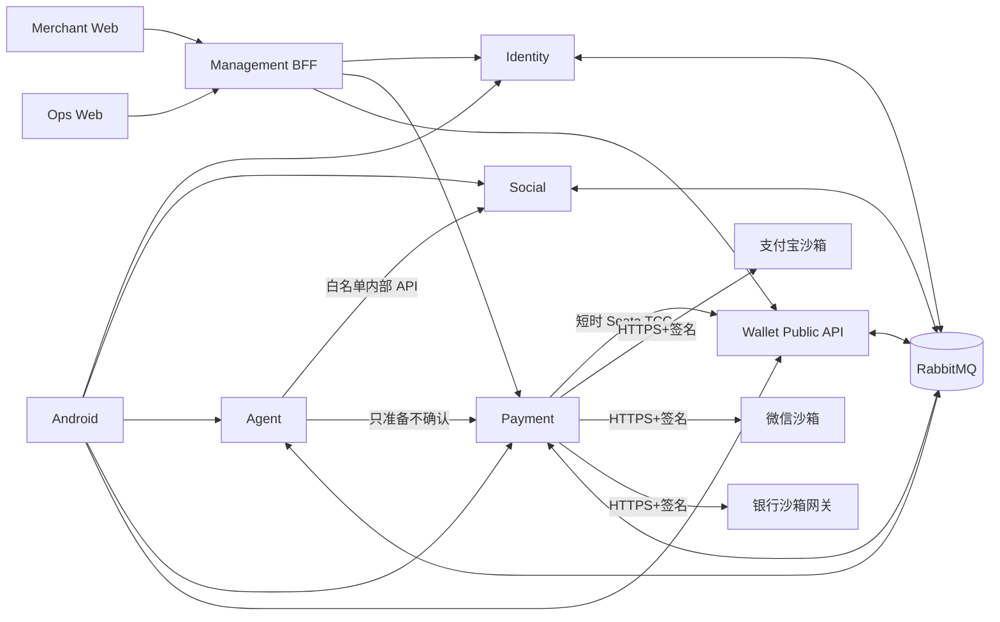
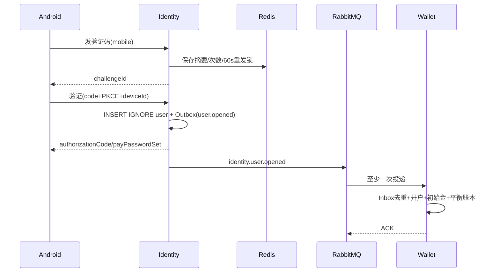
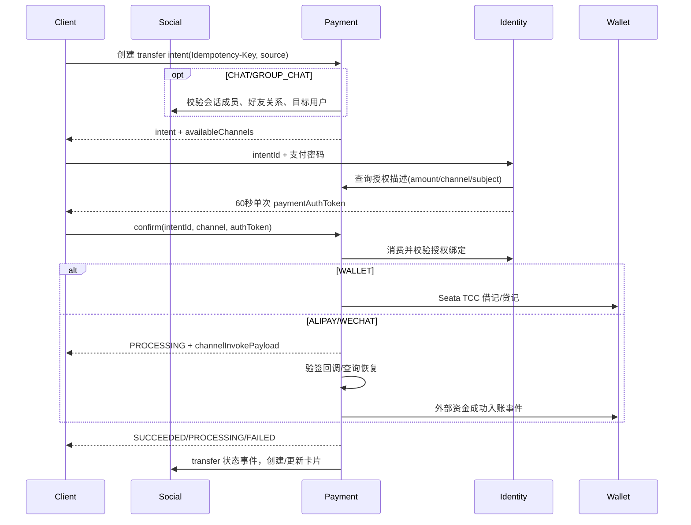
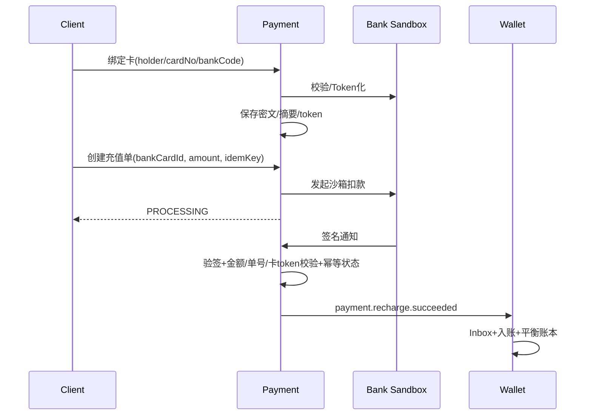
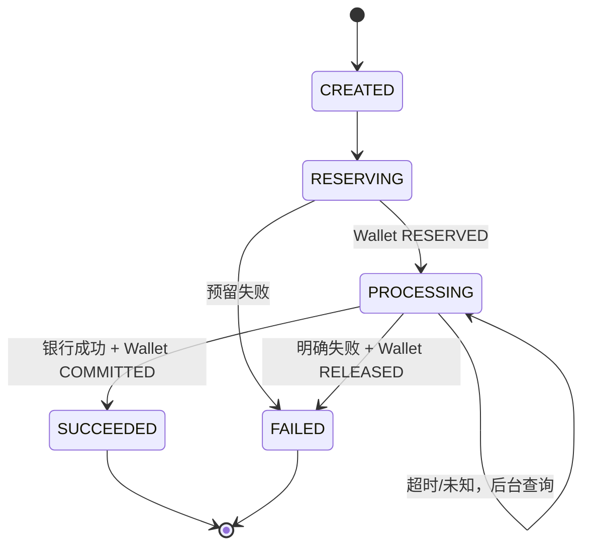
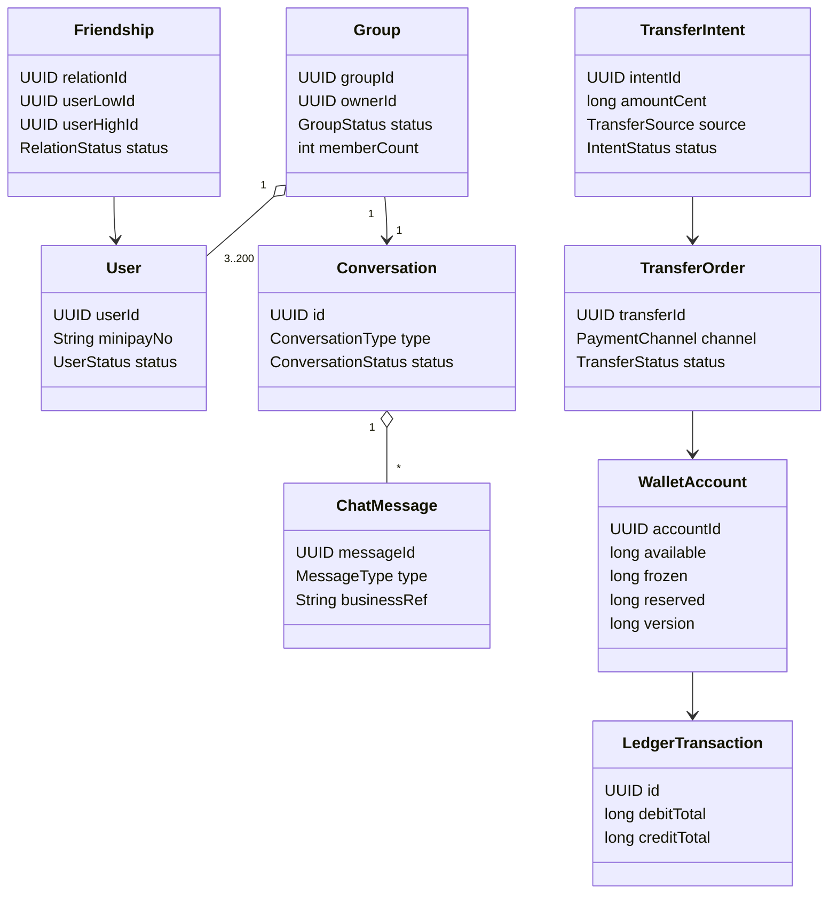

# MiniPay AI 智能支付平台

# 后端系统分析与设计说明书 v1.7.0

## 0. 文档控制

| 项目 | 内容 |
|---|---|
| 产品基线 | `MiniPay-AI-PRD-v1.5.0.md` 的正文 v1.7.0（2026-07-31） |
| 当前代码基线 | 后端 `f995febbe2a84226b1a556ee8b374346c08ad6c6`；前端 `aff01cac73fa8a44a9389b3073642a6e595ed21f` |
| 技术基线 | Java 21、Spring Boot 3.5.9、MyBatis 3.0.5、MySQL 8.4、Redis、RabbitMQ、Seata 2.6.0、OAuth 2.1/OIDC、Flyway、OpenAPI/AsyncAPI、Micrometer、OpenTelemetry |
| 文档定位 | 目标态可执行设计；供开发智能体按模块生成代码、迁移、契约和测试 |
| 非本期 | Consumer Web/H5、iOS、外卖、真实资金、分账、部分退款、争议仲裁、朋友圈 |
| 强约束 | 金额整数分；账本与余额由 Wallet 独占写；支付密码只进 Identity；外部通道不加入长 TCC；已发布迁移只增不改 |

### 0.1 修订记录

| 日期 | 版本 | 标志 | 说明 |
|---|---|---|---|
| 2026-07-30 | 1.4.0 | M | 旧设计：好友/单聊、收款码、支付宝充值/出款 |
| 2026-07-31 | 1.7.0 | M/A | 以银行卡替换充值/出款；支付增加 WALLET/ALIPAY/WECHAT；新增银行卡管理、群聊及群聊私密转账；按当前实现补齐代码落点、数据、API、事件、恢复和测试 |

### 0.2 规范性用语

- “已实现”：当前基线存在生产代码/迁移/测试。
- “骨架”：仅存在启动、安全、契约草案或表结构，不具备完整用例。
- “目标新增”：必须按本文新增，不能在交付说明中宣称已完成。
- “必须/禁止”：代码评审和测试门禁项；不得由实现智能体自行弱化。

# 1. 项目背景

MiniPay AI 是智能支付沙箱，覆盖 Android 消费者、商户 Web 和运营 Web。核心难点不是页面 CRUD，而是身份与支付授权隔离、好友/群聊隐私、三支付通道、银行卡回调、提现冻结恢复、复式账本、租户隔离和回调幂等。

## 1.1 相关资料

| 资料 | 作用 |
|---|---|
| PRD v1.7.0 正文 | 需求、BR-01～37、AC-01～12 |
| `AGENTS.md` | 智能体强制架构、安全、修改和完成规则 |
| `docs/architecture.md` | 服务边界、四层架构、一致性模式 |
| `docs/project-standards.md` | Java、API、数据、消息、测试规范 |
| `contracts/openapi/*.yaml` | 当前 draft 契约；落后于 v1.7.0，需升版补全 |
| 前端系分 v1.7.0 | 页面、交互和目标 JSON 响应 |

## 1.2 参与人

| 角色 | 成员 | 责任 |
|---|---|---|
| 架构/后端负责人 | 待填写 | 边界、契约、资金一致性评审 |
| Identity/安全 | 待填写 | OAuth、短信、支付密码、账号生命周期 |
| Payment/Wallet | 待填写 | 订单、通道、TCC、账本、恢复 |
| Social/Agent | 待填写 | 好友、消息、群聊、AI 工具 |
| BFF/Web 联调 | 待填写 | 商户/运营 Session、租户、聚合 |
| QA/安全 | 待填写 | 资金、越权、幂等、故障注入 |

# 2. 功能模块

## 2.1 功能模块树

```text
MiniPay AI Backend
├─ 1. Identity
│  ├─ 消费者短信登录、PKCE、Token 轮换
│  ├─ 运营/商户 OIDC 登录、RBAC
│  ├─ 用户资料、MiniPay 号、头像
│  ├─ 支付密码设置/重置、60 秒一次性支付授权
│  └─ 账号注销、冷静期、匿名化
├─ 2. Social（新服务）
│  ├─ 好友搜索引用、申请、双向关系
│  ├─ 单聊会话、消息、离线、已读游标
│  ├─ 群创建、成员、群主、退出/解散
│  └─ 群聊私密转账卡片投影
├─ 3. Agent
│  ├─ AI 会话、消息、标题
│  ├─ 长期记忆与用户删除
│  ├─ 好友搜索/转账准备白名单工具
│  └─ SSE 与脱敏 Trace
├─ 4. Payment
│  ├─ 转账意图、转账单、支付单、退款单
│  ├─ WALLET/ALIPAY/WECHAT 三通道编排
│  ├─ 商户、应用、个人/经营收款码
│  ├─ 银行卡、充值单、提现单、银行通知
│  ├─ 商户通知与重试
│  └─ 状态机、幂等、TCC/Saga、恢复任务
├─ 5. Wallet
│  ├─ 消费者/商户/系统账户
│  ├─ 可用、冻结、非 TCC 资金预留
│  ├─ TCC 借记/贷记分支
│  ├─ 复式账本、账单查询
│  └─ 开户与初始 ¥10,000 沙箱资产
└─ 6. Management BFF
   ├─ 商户/运营独立信任域 Session 与 CSRF
   ├─ Token Relay、租户上下文、API 聚合
   ├─ 看板、应用、订单、钱包路由
   └─ 登录/操作审计查询
```

## 2.2 当前实现与目标差距

| 模块 | 当前基线 | v1.7.0 目标 |
|---|---|---|
| Identity | 消费者短信登录/PKCE、运营密码/短信登录、Session/OAuth、登录/退出审计已实现；`user_profile/user_credential/payment_authorization` 表已存在 | 支付密码用例、资料/MiniPay 号、支付授权签发消费、注销 |
| Wallet | 账户、TCC 冻结/待入账、账本 DDL；安全与 TCC 接口骨架，无业务 Controller | 开户、初始金、余额/账单、TCC 实现、资金预留、外部入账 |
| Payment | 转账意图/单、支付/退款 DDL；安全与 TCC 骨架，无业务 Controller | 三通道、收款码、商户应用、银行卡、充值提现、通知、恢复 |
| Social | 仓库中不存在，根 Maven/Compose 均未声明 | 新增独立服务、DB、契约、REST、WebSocket、Outbox/Inbox |
| Agent | 启动、安全、技术消息表 | AI 会话/记忆/SSE/白名单工具 |
| Management BFF | Session/CSRF、登录审计代理、退出处理已实现 | 商户/运营域拆分、业务代理/聚合、权限与租户上下文 |
| OpenAPI | 仅登录、基础转账/退款/钱包/Agent/管理查询草案；充值模型仍是立即成功/失败 | 新增兼容版本，按本文接口补齐；旧 draft 不可直接作为 v1.7.0 真相 |

**重要事实：** 当前 `identity.user.opened` 会在新用户事务中写 Outbox，但 Wallet 尚无对应消费者，因此“首次登录原子开户并发 ¥10,000”尚未闭环。实现时用可靠事件达成最终一致；“原子”指用户只创建一次、初始金只入账一次，不表示跨服务分布式本地事务。

# 3. 总体架构与服务边界



当前部署仅包含一个 `wallet-service` 和 `mysql-core/minipay_wallet` Schema，Wallet 使用独立最小权限账号。Payment 只访问稳定的 Wallet 入口，不保存账户分片号，也不执行哈希路由。站内转账在当前同库条件下并非必须采用分布式事务，但仍固定使用 Debit/Credit 两个 Seata TCC 分支，以便未来 Wallet 物理分片时保持业务调用模型不变。二阶段只能由 Seata Server 驱动，服务不可降级为手工 Confirm/Cancel。

## 3.1 数据所有权

| 服务 | 独占写入 | 允许读取/输出 | 禁止 |
|---|---|---|---|
| Identity | 用户、凭证、角色、支付授权、注销 | 脱敏资料、主体、scope | 余额、银行卡、消息、交易 |
| Social | 好友、会话、群、消息、游标 | 成员校验、脱敏卡片 | 支付密码、交易终态、余额 |
| Agent | AI 会话/消息/记忆/Trace | 受控工具结果 | 业务库直连、确认付款、敏感凭据 |
| Payment | 交易单、商户/应用、收款码、银行卡支付工具、通道通知 | 交易状态、管理投影 | 直接 SQL 修改 Wallet |
| Wallet | 钱包、冻结/预留、账务事务/分录 | 余额、账单、资金结果 | 身份凭据、通道调用 |
| Management BFF | Web Session、CSRF、短时 OAuth 状态 | 聚合 DTO | 保存业务真相、信任浏览器 merchantId |

## 3.2 服务内分层与代码规则

```text
interfaces -> application -> domain
infrastructure -> application/domain ports
bootstrap -> 装配所有层
```

每个用例必须有明确 `Command/Query`、应用服务事务边界、领域状态迁移和出站端口。Controller 只做协议/校验/主体提取；领域层禁止 Spring/MyBatis/HTTP/MQ 注解。服务模块之间禁止 Maven 业务依赖。

## 3.3 API 暴露与部署

- Android 只访问 ingress 暴露的 `/api/v1`、OAuth 端点和 `/ws/v1`；不可访问 `/internal/v1`。
- Web 只访问同源 Management BFF；浏览器不持有 Access Token。
- 外部通道回调只访问 `/openapi/v1/channels/{channel}/notifications`，独立限流和签名校验。
- 服务间使用 Client Credentials、独立 audience/scope；用户 Token 不替代服务 Token。
- `social-service` 必须加入根 `pom.xml`、Compose、独立 MySQL schema/账号、健康检查和镜像构建。

# 4. 核心流程

## 4.1 首次登录、开户与初始资产



Wallet 以 `owner_type + owner_id`、Inbox `event_id + consumer_name`、账务 `business_type + business_no` 三层唯一约束保证只发一次。初始金为 1,000,000 分；对应系统发行账户必须产生相反方向分录。

## 4.2 转账统一流程（表单/AI/单聊/群聊/个人码）



规则：本人不可转；金额 1～1,000,000 分；备注≤50；intent 默认 10 分钟；支付方式确认后不可变；confirm 对同一 intent 只能形成一张 transfer order。群聊场景在 prepare 和 confirm 均复核群/好友关系，避免授权窗口内关系变化。

## 4.3 群聊转账隐私

```mermaid
flowchart TD
  A[群成员@另一成员] --> B{双方是ACTIVE成员且好友?}
  B -- 否 --> X[拒绝 GROUP_TRANSFER_NOT_ALLOWED]
  B -- 是 --> C[创建私密transfer intent]
  C --> D[独立付款确认]
  D --> E[Payment发布脱敏事件]
  E --> F[Social写一条TRANSFER_CARD]
  F --> G{查看者角色}
  G -- 付款方/收款方 --> H[可按transferId向Payment查详情]
  G -- 第三方 --> I[仅显示双方昵称与提示; amount/status=null]
```

Social 数据库的群消息不得保存金额、支付方式、支付授权或通道载荷。事件 Payload 只含 `transferId/payerDisplayName/payeeDisplayName/conversationId`；完整交易信息由 Payment 按资源所有权返回。

## 4.4 经营码三通道支付

1. 扫码解析校验 Token 摘要/签名、用途、有效期、App/商户状态。
2. 创建 `payment_order`，唯一键 `app_id + merchant_order_no`，渠道先为 `UNSELECTED`。
3. 用户选择渠道并取得绑定 payment order 的支付授权；选择后写入 channel 且不可修改。
4. WALLET：付款钱包到商户钱包短时 TCC；ALIPAY/WECHAT：通道回调成功后，Wallet 以 Outbox/Inbox 向商户钱包单次入账。
5. Payment 成功状态与 Outbox 同事务；商户通知异步投递，不得阻塞支付成功。

## 4.5 银行卡绑定与充值

银行卡由 Payment 所有，因为它是支付工具并由 Payment 的银行适配器使用。卡号使用 AES-256-GCM 字段加密，另存 keyed hash 做去重、last4 做展示；API 永不返回 PAN。



充值后余额不得超过 2,000,000 分。同步响应、客户端查询和重复通知都不得直接/重复增加余额。

## 4.6 提现 Saga



- 先校验支付授权、卡状态、余额、注销状态、通道状态，再创建资金预留。
- 外部调用不得持数据库锁，不使用长 TCC。
- 外部明确成功但 Wallet commit 暂失败时，订单保持 `PROCESSING` 并无限幂等重试 commit，绝不释放。
- 明确失败才 release；不确定结果不释放。

## 4.7 全额退款

仅 `payment_order=SUCCEEDED` 且不存在 `PROCESSING/SUCCEEDED` 退款可创建。金额必须等于原单金额。

- WALLET：商户钱包借记、消费者钱包贷记，使用 TCC。
- ALIPAY/WECHAT：先预留商户资金，再调用外部退款；外部成功后 commit 预留，失败 release，不确定保持处理中查询。
- 退款成功状态、账务与商户通知采用 Outbox/Inbox；禁止直接把原支付单改成未支付。

## 4.8 注销

Identity 调用 Wallet/Payment 内部资格查询：余额为零、冻结/预留为零、无处理中转账/充值/提现/支付/退款。通过后进入 `PENDING_COOLING_OFF`，撤销 Refresh Token 并发布限制事件；Payment/Wallet 在写入口二次阻断资金操作。7 天到期任务再次查询，成功后匿名化资料、禁用凭据、撤销会话；账本、订单、审计、历史消息引用保留。

# 5. 领域模型与状态机

## 5.1 核心领域关系



## 5.2 枚举与合法迁移

| 聚合 | 状态 | 合法迁移 |
|---|---|---|
| FriendRequest | PENDING/ACCEPTED/REJECTED/CANCELLED/EXPIRED | PENDING→任一终态 |
| Friendship | ACTIVE/DELETED | ACTIVE↔DELETED（重新接受恢复原关系） |
| Group | ACTIVE/DISSOLVED | ACTIVE→DISSOLVED |
| GroupMember | ACTIVE/LEFT/REMOVED | ACTIVE→LEFT/REMOVED；重新邀请产生新 membership epoch 或受控恢复 |
| TransferIntent | PENDING_CONFIRMATION/CONFIRMED/EXPIRED/CANCELLED | PENDING→CONFIRMED/EXPIRED/CANCELLED |
| TransferOrder | PROCESSING/SUCCEEDED/FAILED/CANCELLED | PROCESSING→终态；SUCCEEDED 不可逆 |
| PaymentOrder | CREATED/PROCESSING/SUCCEEDED/FAILED/CLOSED | CREATED→PROCESSING/CLOSED；PROCESSING→SUCCEEDED/FAILED |
| RechargeOrder | CREATED/PROCESSING/SUCCEEDED/FAILED/CLOSED | 同上 |
| WithdrawalOrder | CREATED/RESERVING/PROCESSING/SUCCEEDED/FAILED | 见 4.6 |
| RefundOrder | PROCESSING/SUCCEEDED/FAILED | PROCESSING→终态 |
| FundReservation | RESERVED/COMMITTED/RELEASED | RESERVED→COMMITTED/RELEASED |
| AccountCancellation | PENDING_COOLING_OFF/CANCELLED/COMPLETED | PENDING→CANCELLED/COMPLETED |
| NotificationDelivery | PENDING/DELIVERING/SUCCEEDED/FAILED | 失败可产生下一次 attempt，不回退业务终态 |

任何非法迁移返回 409 稳定错误码；必须用 `version` 乐观锁或条件更新 `WHERE status=? AND version=?`，影响行数必须为 1。

# 6. 数据库设计

## 6.1 通用约束

- MySQL 8.4、InnoDB、utf8mb4、UTC `DATETIME(6)`；主键 UUIDv7 `BINARY(16)`。
- 金额 `BIGINT` 且字段名带 `_amount_cent`；所有余额/金额非负检查。
- 业务号、幂等键、外部单号、事件 ID、TCC 分支均有唯一索引。
- 禁止物理删除订单、账本、审计和有历史交易的商户/应用；银行卡解绑为状态变更。
- 下述迁移版本为建议落点；若仓库先出现新迁移，实现智能体必须顺延版本，禁止覆盖。

## 6.2 Identity（现有 V1～V5；新增 V6～V8）

### 6.2.1 现有表处理

| 表 | 变更 |
|---|---|
| `user_profile` | V6 新增 `minipay_no VARCHAR(32) UNIQUE`、`avatar_object_key VARCHAR(512)`、`anonymized_at`；保留现有 `login_name/phone_hash` |
| `user_credential` | 复用，`credential_type=PAYMENT_PASSWORD`，Argon2id；不得另建明文/可逆密码表 |
| `payment_authorization` | 新增 `action VARCHAR(32)`、`channel VARCHAR(16)`、`consumed_by_request_id`；令牌摘要唯一；过期/消费索引 |
| `user_role/login_audit/oauth2_*` | 复用；已发布迁移不改写 |

### 6.2.2 新增表

| 表 | 关键列 | 唯一/索引 |
|---|---|---|
| `account_cancellation` | `cancellation_id,user_id,status,requested_at,cooling_off_ends_at,cancelled_at,completed_at,version` | 用户仅一条 PENDING；`status+cooling_off_ends_at` |
| `profile_avatar_upload` | `upload_id,user_id,object_key,status,expires_at,created_at` | object_key 唯一；过期索引 |

注销匿名化必须在 Identity 本地事务更新 `user_profile/user_credential/account_cancellation` 并写 Outbox。

## 6.3 Social（新模块 V1～V3）

| 表 | 必要字段 | 约束/索引 |
|---|---|---|
| `friend_request` | `request_id,requester_id,addressee_id,source,message,status,expires_at,version,created_at,updated_at` | 本人禁止；同方向 PENDING 唯一策略；收件人状态时间索引 |
| `friend_relation` | `relation_id,user_low_id,user_high_id,status,created_at,deleted_at,version` | 排序用户对唯一 |
| `conversation` | `conversation_id,type,pair_key,group_id,status,last_message_id,last_message_at,version` | DIRECT pair_key 唯一；GROUP group_id 唯一；列表索引 |
| `conversation_member` | `conversation_id,user_id,role,status,joined_at,left_at,last_delivered_message_id` | 会话+用户唯一；用户状态索引 |
| `chat_group` | `group_id,conversation_id,owner_user_id,name,avatar_key,status,member_count,max_members,version,created_at` | conversation 唯一；owner/status 索引 |
| `group_member_history` | `history_id,group_id,user_id,action,operator_id,occurred_at` | 群+时间；只增不改 |
| `chat_message` | `message_id,conversation_id,sender_id,client_message_id,type,text_content,business_ref,display_payload,sent_at` | `sender_id+client_message_id` 唯一；会话+消息/时间索引 |
| `message_read_cursor` | `conversation_id,user_id,last_read_message_id,read_at,version` | 会话+用户唯一；只单调前移 |
| `outbox_event/inbox_message` | 标准技术表 | 与其他服务同契约 |

`display_payload` 仅允许非敏感展示 JSON；TRANSFER_CARD 明确禁止 `amountCent/channel/paymentAuthToken`。

## 6.4 Agent（现有 V1；新增 V2）

| 表 | 关键字段 | 约束 |
|---|---|---|
| `ai_conversation` | `conversation_id,user_id,title,status,last_active_at,version` | 用户+活动时间索引 |
| `ai_message` | `message_id,conversation_id,role,content_filtered,client_message_id,created_at` | 用户消息客户端 ID 幂等；内容≤1000 |
| `memory_item` | `memory_id,user_id,content_filtered,source,status,created_at,deleted_at` | 用户状态时间索引 |
| `memory_setting` | `user_id,enabled,version,updated_at` | 用户唯一 |
| `agent_tool_trace` | `trace_id,conversation_id,tool_name,input_digest,result_code,duration_ms,created_at` | 不存原始敏感参数 |

## 6.5 Payment（现有 V1～V2；新增 V3～V7）

### 6.5.1 现有交易表调整

| 表 | 目标新增列/约束 |
|---|---|
| `transfer_intent` | `source,source_conversation_id,source_message_id,channel,client_request_id,version`；`payer+client_request_id` 唯一；remark 收紧 API≤50 |
| `transfer_order` | `channel,channel_order_id,authorized_at`；保留 intent 唯一和 client request 唯一 |
| `payment_order` | `merchant_id,application_id,channel_order_id,selected_at`；channel 初始 UNSELECTED |
| `refund_order` | `channel,fund_reservation_no,failure_code`；只允许全额 |

### 6.5.2 商户、应用、收款码

| 表 | 关键字段 | 约束/索引 |
|---|---|---|
| `merchant` | `merchant_id,merchant_no,owner_user_id,name,status,version,created_at` | merchant_no 唯一；owner 可唯一自助商户 |
| `merchant_application` | `application_id,minipay_app_id,merchant_id,name,status,has_transactions,version` | AppID 唯一；商户+名称索引 |
| `collection_code` | `code_id,code_type,owner_type,owner_id,application_id,token_hash,key_version,status,expires_at` | token_hash 唯一；owner/type/status |
| `merchant_notification_endpoint` | `endpoint_id,application_id,url,status,secret_ref,version` | secret 只存 Secret 引用 |

### 6.5.3 银行卡与通道

| 表 | 关键字段 | 约束/索引 |
|---|---|---|
| `bank_card` | `bank_card_id,owner_type,owner_id,holder_name_cipher,card_no_cipher,card_no_hash,last4,bank_code,channel_token_cipher,is_default,status,key_version,version,bound_at` | owner+card hash 唯一；每 owner ACTIVE≤3 由事务锁保证 |
| `channel_order` | `channel_order_id,business_type,business_id,channel,external_order_no,status,request_digest,response_code,version` | 业务唯一、外部单号唯一 |
| `channel_notification` | `notification_id,channel,external_notification_id,business_no,payload_digest,signature_valid,status,received_at` | channel+外部通知 ID 唯一 |

### 6.5.4 充值、提现、通知

| 表 | 关键字段 | 约束/索引 |
|---|---|---|
| `recharge_order` | `recharge_order_id,no,owner_type,owner_id,wallet_account_id,bank_card_id,amount_cent,status,client_request_id,external_order_no,failure_code,version` | owner+client request 唯一；外部单号唯一；状态时间索引 |
| `withdrawal_order` | `withdrawal_order_id,no,owner_type,owner_id,wallet_account_id,bank_card_id,amount_cent,fund_reservation_no,status,external_order_no,failure_code,next_query_at,version` | 同上；恢复索引 `status+next_query_at` |
| `merchant_notification` | `notification_id,merchant_id,application_id,event_id,type,status,next_attempt_at,attempts,request_summary,response_summary` | application+event+type 唯一；重试索引 |
| `merchant_notification_attempt` | `attempt_id,notification_id,attempt_no,http_status,body_digest,result,occurred_at` | notification+attempt 唯一；只增不改 |
| `operation_audit` | `audit_id,actor_id,merchant_scope,action,resource_type,resource_id,before_digest,after_digest,result,request_id,occurred_at` | actor/time、resource/time |

## 6.6 Wallet（现有 V1～V2；新增 V3～V4）

| 表 | 处理 |
|---|---|
| `wallet_account` | 新增 `reserved_amount_cent BIGINT DEFAULT 0`；约束 available/frozen/reserved≥0；owner 唯一 |
| `account_freeze/pending_credit` | 继续用于 TCC；三阶段必须结合 `tcc_fence_log` |
| `fund_reservation` | `reservation_id,business_type,business_no,account_id,amount_cent,status,version,created_at,updated_at`；业务+账户唯一；状态时间索引 |
| `ledger_transaction/ledger_entry` | 复用；增加外键可选但必须显式应用校验；分录不可更新删除 |
| `wallet_bill_projection` | `bill_id,account_id,business_type,business_no,direction,amount_cent,balance_after_cent,status,occurred_at`；业务+账户+方向唯一；查询索引 |

资金 SQL 必须 `SELECT ... FOR UPDATE` 锁定单账户或固定顺序锁定多账户，防死锁。一次本地资金确认中：更新余额、写账务事务、写全部分录、写账单投影、写 Outbox 必须同事务。

# 7. API 设计

## 7.1 通用协议

- 公共 `/api/v1`；内部 `/internal/v1`；开放回调 `/openapi/v1`。
- 成功资源直返；创建 201；异步 202；无内容 204；分页 `{items,page,size,total}`，页码 0 基，默认 20，最大 100。
- 写接口必须 `Idempotency-Key` 或明确客户端业务 ID；返回相同业务结果，参数摘要冲突返回 `IDEMPOTENCY_KEY_REUSED`。
- 错误 RFC 9457，至少 `type,title,status,code,requestId,detail`；客户端只解析 `code`。
- OpenAPI 中标明 audience、scope、幂等策略、敏感字段 `writeOnly`、状态枚举和所有响应。

## 7.2 Identity API

| 方法 | 路径 | 请求/响应核心 | scope | 状态 |
|---|---|---|---|---|
| POST | `/api/v1/auth/consumer/code/send` | mobile,purpose → challenge/masked/expiry | public+限流 | 已实现 |
| POST | `/api/v1/auth/consumer/code/verify` | challenge/code/PKCE/device → authCode/payPasswordSet | public+限流 | 已实现 |
| GET/PATCH | `/api/v1/users/me` | profile/version → profile | `identity.profile.read/write` | 新增 |
| POST | `/api/v1/users/me/avatar-uploads` | mime/size → uploadUrl/objectKey/expiry | `identity.profile.write` | 新增 |
| PUT | `/api/v1/users/me/payment-password` | newPassword/verificationToken | `identity.security.write` | 新增 |
| POST | `/api/v1/payment-authorizations` | intentId/payPassword/deviceId → writeOnly token/expiry | `identity.payment-authorization.write` | 草案有、实现无 |
| POST | `/api/v1/account-cancellations` | confirm → status/coolingOffEndsAt | `identity.account.write` | 新增 |
| DELETE | `/api/v1/account-cancellations/current` | →204 | `identity.account.write` | 新增 |

内部：`GET /internal/v1/payment-intents/{id}/authorization-descriptor` 由 Payment 提供；Identity 据此绑定 `userId/action/subjectId/amount/channel/device`。Payment 调 `POST /internal/v1/payment-authorizations/{token}/consume` 原子消费；只返回是否有效及绑定摘要，不返回密码。

## 7.3 Social API

| 方法 | 路径 | 规则 |
|---|---|---|
| POST/GET | `/api/v1/friend-requests` | 创建带幂等键；分页本人收发申请 |
| POST | `/api/v1/friend-requests/{id}/accept`、`/reject` | 仅收件人；重复操作返回原终态 |
| GET/DELETE | `/api/v1/friends`、`/friends/{userId}` | 搜索/详情/逻辑删除 |
| POST/GET | `/api/v1/conversations` | DIRECT 唯一；单聊群聊混排 |
| GET/POST | `/api/v1/conversations/{id}/messages` | 游标分页；发送使用 clientMessageId |
| PUT | `/api/v1/conversations/{id}/read-cursor` | 只单调前移 |
| POST/GET/PATCH | `/api/v1/groups`、`/groups/{id}` | 至少 3 人总成员、群名 2～20 |
| POST/DELETE | `/api/v1/groups/{id}/members`、`/members/{userId}` | 群主权限、上限 200 |
| PUT | `/api/v1/groups/{id}/owner` | 新群主必须 ACTIVE 成员 |
| POST | `/api/v1/groups/{id}/leave`、`/dissolve` | 幂等、保留历史 |
| WS | `/ws/v1/messages` | Token 握手；帧版本化；只推本人可见数据 |

内部：`POST /internal/v1/social/transfer-context-validations` 输入 payer/payee/sourceConversationId，返回 `allowed/conversationType/displayNames/validationVersion`。不得返回消息正文或全部成员。

## 7.4 Agent API

| 方法 | 路径 | 说明 |
|---|---|---|
| GET/POST | `/api/v1/agent/conversations` | 分页/新建 |
| PATCH/DELETE | `/api/v1/agent/conversations/{id}` | 重命名/逻辑删除 |
| GET | `/api/v1/agent/conversations/{id}/messages` | 游标分页 |
| POST | `/api/v1/agent/conversations/{id}/messages` | `text/event-stream`；clientMessageId 幂等 |
| GET/DELETE | `/api/v1/agent/memories`、`/{id}` | 用户所有权 |
| GET/PUT | `/api/v1/agent/memory-settings` | 总开关 |

白名单工具仅 `search_friend/get_balance/list_bills/prepare_transfer`。工具调用参数由服务端从主体和结构化槽位组装；模型不得提供任意 URL、SQL、scope 或 userId。

## 7.5 Payment/Wallet 消费者 API

| 领域 | 方法与路径 | 核心约束 |
|---|---|---|
| 转账 | `POST /transfers`、`POST /transfers/{intentId}/confirm`、`GET /transfers/{id}` | prepare/confirm 分离；confirm 200/202 |
| 扫码 | `POST /scan-resolutions` | 原始 Token 仅短时处理，不记录 |
| 收款码 | `GET /personal-collection-codes/current`、`POST /business-applications`、`GET /business-collection-codes/current` | 不暴露 owner ID |
| 收款记录 | `GET /collection-records` | 个人转账/经营支付投影 |
| 银行卡 | `GET/POST /bank-cards`、`PUT /bank-cards/{id}/default`、`DELETE /bank-cards/{id}` | 最多3张；响应只 last4；解绑需授权且无处理中提现 |
| 充值 | `POST /recharge-orders`、`GET /recharge-orders/{id}` | 201 后通常 PROCESSING；余额上限 |
| 提现 | `POST /withdrawal-intents`、`POST /withdrawal-orders`、`GET /withdrawal-orders/{id}` | 支付授权、资金预留、202 |
| 钱包 | `GET /wallets/me`、`GET /wallets/me/bills` | owner 从 Token；日期最大365天 |
| 订单 | `GET /orders`、`GET /orders/{type}/{id}` | 支付/转账/充值/提现统一投影 |

## 7.6 商户 API

统一 `/api/v1/merchant`，merchantId 从 BFF Token/Session 派生：

- `GET /dashboard?range=7d|30d`
- `GET/POST /applications`，`GET/PATCH/DELETE /applications/{id}`，`POST /applications/{id}/enable|disable`
- `GET /payment-orders|refunds|transfers` 及 `/{id}`
- `POST /refunds`（全额、二次确认、幂等）
- `GET /wallet`、`GET /wallet/bills`；资金写操作复用消费者充值/提现/转账领域能力但主体为 MERCHANT。

有历史交易的应用 DELETE 返回 409 `APPLICATION_HAS_TRANSACTIONS`，只能 disable。

## 7.7 运营 API

统一 `/api/v1/ops`：

- `GET /dashboard`
- `GET/POST /merchants`，`GET/PATCH/DELETE /merchants/{id}`，`POST /merchants/{id}/enable|disable`
- `GET/POST /applications`，详情、编辑、启停、条件删除
- `GET /payment-orders|refunds|transfers` 及详情，只读
- `GET /notifications`、`GET /notifications/{id}`、`POST /notifications/{id}/retry`
- `GET /audits/operations`；现有登录审计代理可兼容迁至 `/ops/audits/logins`

每个高风险写操作都需要权限、`Idempotency-Key`、二次确认标识（仅 UX，不能替代授权）和 `operation_audit`。

## 7.8 核心错误码

| HTTP | code | 场景 |
|---:|---|---|
| 400 | `VALIDATION_FAILED` | 格式错误 |
| 401 | `TOKEN_INVALID` / `PAYMENT_AUTH_INVALID` | 身份或支付授权无效 |
| 403 | `RESOURCE_FORBIDDEN` / `TENANT_FORBIDDEN` | 资源/租户越权 |
| 409 | `INVALID_STATE_TRANSITION` | 非法状态迁移 |
| 409 | `INSUFFICIENT_BALANCE` | 可用余额不足 |
| 409 | `IDEMPOTENCY_KEY_REUSED` | 同键不同参数 |
| 409 | `GROUP_TRANSFER_NOT_ALLOWED` | 非成员/非好友/群失效 |
| 409 | `BANK_CARD_IN_USE` | 处理中提现不可解绑 |
| 422 | `AMOUNT_OUT_OF_RANGE` / `BALANCE_LIMIT_EXCEEDED` | 金额规则 |
| 423 | `SMS_LOCKED` / `PAY_PASSWORD_LOCKED` | 尝试超限 |
| 429 | `RATE_LIMITED` | 频率限制 |
| 502 | `CHANNEL_RESPONSE_INVALID` | 通道响应不可验证 |
| 503 | `BANK_CHANNEL_UNAVAILABLE` / `PAYMENT_CHANNEL_UNAVAILABLE` | 通道不可用，禁止伪造成功 |

# 8. 事件契约

## 8.1 固定信封

```json
{
  "eventId": "uuid-v7",
  "eventType": "payment.transfer.succeeded",
  "aggregateType": "transfer_order",
  "aggregateId": "uuid-v7",
  "occurredAt": "2026-07-31T10:00:00Z",
  "traceId": "otel-trace-id",
  "payloadVersion": 1,
  "payload": {}
}
```

## 8.2 事件清单

| 生产者 | 事件 | 消费者/作用 |
|---|---|---|
| Identity | `identity.user.opened.v1` | Wallet 开户/初始金 |
| Identity | `identity.account-cancellation.requested.v1`、`cancelled.v1`、`completed.v1` | Payment/Wallet 阻断或恢复写入；Social 会话处理 |
| Social | `social.friend-request.accepted.v1` | 可观测/通知 |
| Social | `social.group.member-added.v1`、`removed.v1`、`left.v1`、`dissolved.v1` | 推送/缓存失效 |
| Payment | `payment.transfer.processing.v1`、`succeeded.v1`、`failed.v1` | Social 转账卡、通知、投影 |
| Payment | `payment.payment-order.succeeded.v1`、`failed.v1` | Wallet 外部通道入账、看板、商户通知 |
| Payment | `payment.recharge.succeeded.v1`、`failed.v1` | Wallet 单次入账 |
| Payment | `payment.withdrawal.succeeded.v1`、`failed.v1` | 投影/通知；资金动作由显式 Wallet 命令完成 |
| Payment | `payment.refund.succeeded.v1`、`failed.v1` | 投影/通知 |
| Wallet | `wallet.opened.v1`、`funds-reserved.v1`、`committed.v1`、`released.v1` | Payment 状态推进 |

生产者业务状态与 Outbox 同事务；消费者 Inbox 与本地更新同事务。事件至少一次投递，禁止假设只投递一次。事件不携带支付密码、银行卡 PAN、消息正文、Token、密钥或完整通道报文。

# 9. 关键技术设计

## 9.1 幂等

1. 网关/Controller 校验 `Idempotency-Key` 16～128 字符。
2. 应用层计算规范化请求摘要，保存 `subject + operation + key + digest + resource_id + response_status`。
3. 同键同摘要返回原资源；同键不同摘要 409。
4. 外部通知以 `channel + externalNotificationId` 去重；缺通知 ID 时使用经严格规范化的稳定字段摘要。
5. 消息使用 `senderId + clientMessageId`；TCC 使用 `xid+branchId`；事件使用 Inbox；账务使用 `businessType+businessNo`。

不得只靠 Redis 做资金幂等；数据库唯一约束是最终防线。

## 9.2 Wallet TCC

- Try：校验账户 ACTIVE 和余额；借记侧从 available 转 frozen，贷记侧写 pending_credit；只预留不写最终账本。
- Confirm：借记 frozen 减少、贷记 available 增加，并各自在本地事务写对应账务/分录；必须幂等。
- Cancel：释放借记 frozen、取消 pending credit；处理空回滚。
- 防悬挂：Cancel 先到时写 fence，后到 Try 必须拒绝。
- Payment 通过全局事务推进本地订单 TCC Action 和两个 Wallet 分支；锁账户按 UUID 字节序固定顺序。

测试必须覆盖 Try 第二分支失败、重复 Confirm/Cancel、Cancel 先到、协调器重启和网络超时。

## 9.3 非 TCC 资金预留

提现/外部退款使用 `fund_reservation`：

```text
reserve: available -= amount; reserved += amount; status=RESERVED
commit : reserved  -= amount; status=COMMITTED; write balanced ledger
release: available += amount; reserved -= amount; status=RELEASED
```

三个命令均按 `businessNo+accountId` 幂等。commit/release 互斥且不可反向；外部成功后只允许 commit 重试。

## 9.4 复式记账模板

Wallet 必须预置并保护系统账户：`SANDBOX_ISSUANCE`、`BANK_CLEARING`、`ALIPAY_CLEARING`、`WECHAT_CLEARING`。系统账户也使用 `wallet_account`，但不允许公共 API 查询或操作。每笔账务借贷总额相等：

| 场景 | DEBIT | CREDIT | businessType |
|---|---|---|---|
| 首次沙箱金 | SANDBOX_ISSUANCE | Consumer Wallet | `INITIAL_GRANT` |
| 钱包转账/经营支付 | Payer Wallet | Receiver/Merchant Wallet | `TRANSFER` / `PAYMENT` |
| 银行充值成功 | BANK_CLEARING | Consumer/Merchant Wallet | `RECHARGE` |
| 银行提现成功 | Consumer/Merchant Wallet | BANK_CLEARING | `WITHDRAWAL` |
| 支付宝/微信支付成功 | 对应 CHANNEL_CLEARING | Receiver/Merchant Wallet | `EXTERNAL_PAYMENT` |
| 钱包退款 | Merchant Wallet | Payer Wallet | `REFUND` |
| 外部渠道退款 | Merchant Wallet | 对应 CHANNEL_CLEARING | `EXTERNAL_REFUND` |

`ledger_transaction.business_type + business_no` 唯一。账务分录的方向、账户和金额由应用服务按固定模板生成，Controller 或通道适配器不得传入任意分录数组。系统清算账户允许形成沙箱净头寸，但每笔事务仍必须平衡；日终对账比较通道订单净额与清算账户变动。

## 9.5 通道适配器

定义应用出站端口：

```java
interface PaymentChannelGateway {
  ChannelInitiation initiate(ChannelPaymentCommand command);
  ChannelQueryResult query(ChannelQuery query);
  ChannelRefundResult refund(ChannelRefundCommand command);
  VerifiedNotification verify(NotificationHeaders headers, byte[] body);
}
interface BankGateway {
  BankCardToken tokenize(BankCardPlaintext card);
  BankDebitResult debit(BankDebitCommand command);
  BankPayoutResult payout(BankPayoutCommand command);
  BankQueryResult query(BankQuery query);
}
```

领域层不得出现支付宝/微信/银行 SDK 类型。超时分连接/读取/总体；通道结果映射为 `DEFINITE_SUCCESS/DEFINITE_FAILURE/UNKNOWN`。UNKNOWN 只能进入查询恢复。

## 9.6 银行卡加密与密钥轮换

- PAN、持卡人名、通道 Token：AES-256-GCM，随机 nonce，保存 `ciphertext/key_version`。
- 去重 Hash：HMAC-SHA-256(PAN, 独立 pepper)，不可复用加密密钥。
- 展示只返回银行名/last4/脱敏姓名；日志永不记录 PAN、密文或 Token。
- 密钥来自 KMS/Secret；轮换先新写新版本、读兼容旧版本，再后台重加密。重加密任务按主键游标、乐观锁和审计执行。

## 9.7 群消息和可见性

消息查询先验证当前用户在相应 membership epoch 中有历史可见权。退出后 `left_at` 之后的消息不可见/不推送，之前历史可见。群解散后所有成员只读。

TRANSFER_CARD 序列化器按 viewer 生成 DTO：

- PARTY：返回 `transferId/displayText/viewerRole`，金额和状态仍由 Payment 详情查询返回。
- BYSTANDER：`amountCent=null,status=null`，不提供可推断通道的字段。

## 9.8 商户租户与 RBAC

- BFF 登录注册分为商户和运营两个 client/redirect/session cookie；不能用运营 Session 访问商户域。
- merchantId 来自 Identity Token claim 或服务端映射。请求中的 merchantId 只能作为运营筛选条件，商户接口忽略/拒绝。
- Payment Repository 查询方法显式接收 `TenantScope` 并在 SQL 加 `merchant_id=?`；禁止通用 MyBatis 拦截器静默猜测租户。
- scope 细分 read/write/retry；前端菜单只做体验，资源服务二次授权。

## 9.9 看板投影

支付/退款终态事件驱动 `merchant_daily_metric/platform_daily_metric` 查询投影，事件 ID 去重。响应必须包含 `timezone/from/to/dataAsOf`。投影可重建，不作为订单/资金事实；修复使用重放事件或按事实表离线重算，禁止改订单。

## 9.10 恢复任务

| 任务 | 扫描条件 | 动作 | 告警 |
|---|---|---|---|
| 充值恢复 | PROCESSING 超阈值 | 查询银行；成功推进事件，失败终止，未知退避 | 最老处理时长 |
| 提现恢复 | PROCESSING 且 next_query_at≤now | 查询银行；commit/release | 预留年龄、UNKNOWN 次数 |
| 外部支付/退款 | PROCESSING 超阈值 | 查支付宝/微信 | 通道分布、失败率 |
| Outbox | PENDING/FAILED 可重试 | publisher confirm、退避、DLQ | 积压、最老事件 |
| 通知重试 | FAILED 且 next_attempt_at≤now | HTTPS 重投，限制最大自动次数 | 商户失败数 |
| 好友申请过期 | PENDING 且 expires_at≤now | 条件更新 EXPIRED | 扫描延迟 |
| 注销完成 | PENDING 且 cooling_off_ends_at≤now | 再校验、匿名化 | 失败原因 |

任务使用数据库租约/分片、批量上限、可重入；禁止无条件全表更新。

## 9.11 配置与 Secret

| 配置组 | 必需项 | 规则 |
|---|---|---|
| OAuth | issuer、audience、client ID、client secret、JWT key refs | secret 无仓库默认值；启动时校验 |
| 支付通道 | ALIPAY/WECHAT gateway、AppID、key/cert refs、notify URL、connect/read timeout、enabled | 各通道独立开关；禁用返回稳定错误 |
| 银行 | gateway、merchant ID、signing key ref、encryption key ref/version、notify URL、timeout | 卡加密密钥与通知验签密钥分离 |
| 消息 | RabbitMQ exchange/queue/DLQ、publisher confirm、重试退避 | 队列名含环境前缀，禁止误连生产 |
| Social | WS 心跳、最大连接、消息长度、群上限 | 群上限产品值固定 200，不得仅靠前端 |
| 对象存储 | endpoint、bucket、credential ref、上传大小/MIME 白名单 | 返回短期上传凭证 |

本地演示默认值只能用于非敏感地址、端口和演示开关；密钥、pepper、数据库密码、OAuth secret 必须由环境变量/Secret 提供。生产启动若缺少启用通道的关键配置应 readiness 失败，不能降级成伪成功。

## 9.12 可观测性

传播 `requestId/traceId/businessNo/eventId/xid/branchId`。必须监控：API P95/错误率、OAuth/短信锁定、WS 连接/重连、AI 工具拒绝、订单状态年龄、通道验签失败/重复通知、TCC 未决、资金预留年龄、账本借贷差、Outbox/DLQ、商户通知失败、租户越权拒绝。

日志禁止密码、验证码、完整手机号、银行卡、消息正文、Authorization/Cookie/Token、密钥和完整回调；通道只留摘要、外部单号脱敏和响应码。

# 10. 代码落点与实施顺序

## 10.1 包与类落点示例

| 能力 | 主要落点 |
|---|---|
| 支付密码 | `identity/application/service/PaymentPasswordService`、`PaymentAuthorizationService`；端口/Repository/Controller 分层 |
| Wallet 开户 | `wallet/interfaces/messaging/UserOpenedConsumer` → `application/service/OpenWalletService` |
| 转账 | `payment/application/service/PrepareTransferService/ConfirmTransferService`；`domain/model/TransferIntent/TransferOrder` |
| TCC | 现有 `TransferOrderTccAction`、`DebitAccountTccAction/CreditAccountTccAction` 补全，业务逻辑下沉应用服务 |
| 银行通道 | `payment/application/port/BankGateway`；`infrastructure/client/bank/*` |
| 社交 | 新 `services/social-service`，按四层完整创建；WebSocket 仅接口适配 |
| 群聊 | `social/domain/model/ChatGroup/GroupMember`、`application/service/ManageGroupService` |
| Agent 工具 | `agent/application/port/SocialToolClient/PaymentToolClient`；注册白名单 |
| 管理 BFF | `management-bff/interfaces/rest/merchant`、`interfaces/rest/ops` 与 token relay client；不得写业务库 |

## 10.2 分阶段交付

| 阶段 | 内容 | 完成定义 |
|---|---|---|
| 0 契约 | OpenAPI v1.7、AsyncAPI、错误码、页码统一 | 契约校验和前端生成通过 |
| 1 身份/开户 | 资料、支付密码、授权、Wallet 消费开户事件 | 首登仅一次初始金、账本平衡 |
| 2 Wallet/转账 | 余额账单、TCC、表单转账 | TCC 故障矩阵通过 |
| 3 Social | 好友、单聊、消息、WS、群聊 | 离线/幂等/成员权限通过 |
| 4 群转账/AI | 私密卡、Agent 会话/记忆/工具 | 第三方零敏感字段，AI 不能 confirm |
| 5 扫码/商户 | 商户应用、三码、经营支付 | 停用即时生效、租户隔离 |
| 6 银行/多通道 | 绑卡、充值提现、支付宝/微信、退款、恢复 | 重复回调不重复入账，UNKNOWN 可恢复 |
| 7 管理平台 | 商户/运营 BFF、看板、通知、审计 | RBAC/租户/审计通过 |
| 8 注销/加固 | 冷静期、匿名化、全量安全/压测 | AC-01～12、发布门禁通过 |

部署顺序：MySQL/Redis/RabbitMQ/Seata → Identity → Wallet → Payment → Social → Agent → Management BFF。Seata 是新转账的必需基础设施；数据库迁移先于对应应用，新消费者必须能忽略未知事件版本。

# 11. 测试与验收

## 11.1 自动化测试矩阵

| 层级 | 必测 |
|---|---|
| 单元 | 所有状态机、金额边界、昵称/群名/卡号校验、权限决策、敏感过滤 |
| 应用模块 | 每个 Command/Query 的成功、幂等、冲突、端口失败；事务外不得持锁远调 |
| MySQL 集成 | Flyway 空库升级、唯一/检查约束、乐观锁、并发绑卡≤3、账本平衡 |
| Redis | 验证码 5 次/10 分钟、60 秒重发、并发消费、限流 |
| RabbitMQ | Outbox confirm、重复/乱序、Inbox、DLQ、消费者重启 |
| TCC | 成功、Try 失败、重复 Confirm/Cancel、空回滚、防悬挂、协调器恢复 |
| 通道契约 | 验签、金额/AppID/单号不符、重复通知、超时、未知、查询恢复 |
| WebSocket | 非成员订阅、退群后推送、断线补拉、重复 clientMessageId、游标单调 |
| 安全 | issuer/audience/scope、CSRF、Token 复用、租户/好友/群/订单越权、敏感日志 |
| E2E | PRD AC-01～AC-12，含群聊第三方查看、银行卡充值提现和三通道 |

测试数据库必须使用 Testcontainers MySQL，不用 H2。公共契约/基础设施/根模块变更执行 `mvn verify`；Social 新模块必须有 ArchUnit 验证分层和禁止跨服务依赖。

## 11.2 关键并发与故障用例

1. 同手机号并发首次登录：一个 user、一个 wallet、一次 1,000,000 分入账。
2. 同 intent 并发 confirm：一张 order、一次授权消费、一次扣/入账。
3. 银行/支付宝/微信重复 100 次回调：订单一次终态、账本一次变化。
4. 外部提现成功后 Wallet 暂不可用：资金保持预留，恢复后 commit，不释放。
5. 群转账完成同时付款方退群/删好友：交易状态正确，之后第三方仍无金额；卡片历史策略一致。
6. 商户 A 枚举商户 B ID：列表、详情、写操作均 403/404 安全响应且审计。
7. 注销到期同时有资金请求：以资格复核和资金入口账户状态锁定消除竞态。

## 11.3 需求追踪

| PRD | 后端模块 | 核心验证 |
|---|---|---|
| REQ-001 / AC-01 | Identity/Wallet | 登录、支付密码、单次开户初始金 |
| REQ-002 / AC-02 | Agent/Payment | AI 只准备、独立确认 |
| REQ-003/011 / AC-03/12 | Social | 好友、消息、群、离线、成员管理 |
| REQ-004 / AC-04 | Payment/Wallet/Social | 单聊/群聊转账及隐私 |
| REQ-005 / AC-05 | Payment/Identity/Social | 三码分流与篡改/停用拒绝 |
| REQ-006/010 / AC-06 | Payment/Wallet | 银行卡、充值、提现、恢复 |
| REQ-007 / AC-09 | Identity/Agent/Payment | 资料、记忆、银行卡、注销 |
| REQ-008 / AC-07 | BFF/Payment/Wallet | 商户租户、看板、订单、钱包 |
| REQ-009 / AC-08 | BFF/Payment | 运营管理、通知、审计 |
| AC-10/11 | 全部 | 沙箱、安全、性能、页面状态支持 |

# 12. 非功能、风险与完成定义

## 12.1 性能目标及容量假设

| 接口 | 目标 | 设计 |
|---|---|---|
| 普通查询 | P95≤500ms | 索引分页、投影、最大100 |
| 转账/支付同步受理 | P95≤2s（不含外部终态等待） | 短事务、外部异步、202 |
| 消息发送落库 | P95≤300ms | 本地事务+Outbox，推送异步 |
| 页面依赖聚合 | 页面≤3s | BFF 并发只读聚合、超时降级 |

容量评估前先按演示规模：群上限200、会话页50、普通页20/最大100；任何无界查询和一次加载全部群消息禁止。

## 12.2 风险

| 风险 | 等级 | 缓解 |
|---|---|---|
| 当前骨架距 PRD 完整范围较大 | 高 | 分阶段、每阶段契约+迁移+测试完整闭环 |
| 旧 v1.4 设计与新银行卡规则冲突 | 高 | 本文取代旧充值/出款章节；契约升版，旧草案标 deprecated |
| 外部通道未知结果造成重复/资金丢失 | 高 | 三值结果、预留、查询恢复、数据库幂等 |
| 群转账隐私 | 高 | 事件最小化、按 viewer DTO、资源所有权测试 |
| 多服务注销竞态 | 高 | 两次资格校验、账户状态事件、写入口二次阻断 |
| 商户/运营混用信任域 | 高 | 独立 OAuth client/cookie/audience/scope、资源服务租户过滤 |
| 看板与事实不一致 | 中 | 投影可重建、dataAsOf、对账任务 |

## 12.3 完成定义

每项能力只有同时满足以下条件才算完成：

1. 版本化 OpenAPI/AsyncAPI、前端生成类型和契约测试一致。
2. 只增不改的 Flyway 迁移可从空库和上一版本升级。
3. Controller/应用/领域/基础设施分层及 ArchUnit 通过。
4. 主体、scope、租户、资源所有权、幂等和状态机完整。
5. 资金能力具备账本平衡、TCC/Saga 故障测试和恢复任务。
6. 日志、Trace、指标、告警和审计不含敏感字段。
7. 相关模块测试、根 `mvn verify`、安全/越权/E2E 通过。
8. 交付说明列出行为、迁移、配置、验证、回滚影响和未覆盖风险。

当前仓库除身份与运营认证/审计外仍以骨架为主；实现智能体不得把本设计中的目标表、接口、服务或流程描述为现有完成项。
