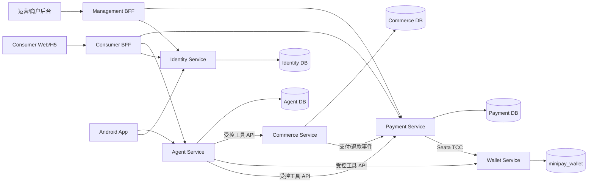

# MiniPay AI 后端整体架构与分层

## 1. 架构目标

MiniPay AI 是可演进 MVP，不以服务数量作为成熟度指标。架构优先级依次为：

1. 资金、账本和订单状态正确。
2. 安全边界明确，敏感凭据最小化流转。
3. 服务可独立测试、部署和恢复。
4. 一个人可以在本地完整启动和调试。
5. 未来可按容量或团队边界扩展，而不重写领域模型。

系统采用 Monorepo 管理多个独立部署服务。支付与外卖保持独立领域；钱包从支付编排中拆出，是为了让资金所有权单一，并满足跨分片 TCC 的硬约束。

> **当前目标范围**：代码库在既有身份、支付、钱包、BFF 与社交聊天能力之上建设 Android 沙箱 AI 智能体。`commerce-service` 已参与 Reactor 与 Compose，作为沙箱外卖的数据所有者；外卖与支付通过 Saga + Outbox/Inbox 协作。详细设计见 `docs/MiniPay-AI-Agent-系统分析与设计-v1.0.md`。

## 2. 系统视图



### 2.1 服务职责

| 服务 | 数据所有权 | 允许做什么 | 禁止做什么 |
|---|---|---|---|
| Identity | 用户、凭证、OAuth Client、授权、角色、支付密码摘要 | 登录、发 Token、RBAC、短信验证、支付授权 | 管理余额、支付单或外卖订单 |
| Consumer BFF | Web 会话与临时 CSRF 状态 | OAuth Client、Token Relay、同源 API/SSE 代理 | 保存业务真相或接触支付密码明文日志 |
| Management BFF | 管理端会话与临时 CSRF 状态 | 分域登录、管理 API 代理、租户上下文转发 | 绕过资源服务 RBAC/租户校验 |
| Payment | 支付单、退款单、转账单、商户应用、通道通知 | 支付编排、验签、幂等、TCC 全局事务 | 直接更新钱包表或外卖订单 |
| Wallet | 账户、冻结、待入账、账务事务、账本分录 | 余额和账本原子更新、TCC 分支 | 暴露任意余额修改接口 |
| Commerce | 沙箱商家、菜单、SKU、库存、购物车、地址、报价、外卖订单、配送 | 权威结算、订单履约、取消退款编排 | 修改支付状态、钱包余额或账本 |
| Agent | 社交聊天、AI 会话、消息、Run、槽位、工具 Trace、显式记忆 | 意图识别、受控工具调用、SSE、确定性卡片 | 直接访问业务库、执行 W2 或绕过人工确认 |

## 3. 服务内分层

每个业务服务使用四层结构，启动与装配代码单独放在根包：

```text
com.minipay.<service>
├─ interfaces
│  ├─ rest
│  ├─ messaging
│  └─ scheduler
├─ application
│  ├─ command
│  ├─ query
│  ├─ service
│  └─ port
├─ domain
│  ├─ model
│  ├─ service
│  ├─ event
│  └─ repository
└─ infrastructure
   ├─ persistence
   ├─ messaging
   ├─ client
   ├─ security
   └─ config
```

### 3.1 各层职责

- `interfaces`：协议适配。负责鉴权上下文提取、参数校验、DTO 转换和 HTTP/MQ 响应，不承载业务规则。
- `application`：用例编排、事务边界、命令/查询、幂等入口和出站端口。它决定“做什么”，不包含数据库实现。
- `domain`：聚合、实体、值对象、状态机、领域服务和领域事件。保持纯 Java，不依赖框架。
- `infrastructure`：MyBatis Mapper/PO、RabbitMQ、HTTP Client、Redis、Seata、第三方通道和安全适配，实现出站端口。
- 启动根包：Spring Boot Application 与模块装配；不得成为通用工具垃圾场。

依赖方向只能是：

```text
interfaces ──> application ──> domain
infrastructure ──> application/domain ports
bootstrap ──> all layers for wiring only
```

服务模块之间不得建立 Maven 依赖。跨服务契约以 OpenAPI/AsyncAPI 文件和兼容性测试管理，不共享领域 Java 类。

## 4. 数据与一致性架构

### 4.1 数据所有权

- 每个服务使用独立 schema 和数据库账号。
- 当前只部署一个 Wallet Service 和 `mysql-core` 中的一个 `minipay_wallet` Schema；专用账号只拥有 Wallet Schema 权限。
- Payment 不保存分片号，也不执行 `hash % n`。未来物理分片由 Wallet 稳定入口和 Wallet 域拥有的分片目录路由。
- MySQL 是业务真相；Redis 只用于验证码、限流、短会话和缓存。
- 余额与账本同属 Wallet，并在 Confirm 的本地事务中一起提交。
- 外卖与支付各自维护状态机，通过业务单号和事件关联，不共享状态字段。

### 4.2 一致性模式选择

| 场景 | 模式 | 原因 |
|---|---|---|
| 跨钱包分片站内转账 | Seata TCC | 可冻结和预留，要求短时强一致 |
| WALLET 通道支付 | Seata TCC | 支付单、付款钱包和内部清算账户需原子推进 |
| 内部钱包退款/冲正 | Seata TCC | 资金动作可补偿且必须防止重复入账 |
| 外卖下单与支付 | Saga + Outbox/Inbox | 存在用户等待和异步回调，不适合长事务 |
| 模拟/外部通道回调 | 幂等状态机 + Outbox | 外部系统不能加入本地 TCC |
| 注册、开户、演示金 | 可靠事件 + 重试 | 允许短暂最终一致，失败可恢复 |
| 履约、配送、日结调度 | 状态机 + 任务租约 | 长流程应可暂停、重试和审计 |

站内转账即使当前同库也固定创建 Debit/Credit 两个 Seata TCC 分支。Payment 保存真实 XID 作为审计和恢复线索，但不手工推进二阶段；Wallet 使用 Seata `tcc_fence_log`、业务唯一键和状态检查共同保证幂等、空回滚、防悬挂及单次记账。该选择是面向未来物理分片的扩展约束，不是单库转账的技术必需。

### 4.3 Outbox/Inbox

生产者在业务本地事务中写入 Outbox；发布器把事件投递到 RabbitMQ。消费者先以 `event_id` 写入 Inbox，再执行幂等状态迁移。系统接受至少一次投递，不假设消息只会出现一次。

事件信封固定包含：

```json
{
  "eventId": "uuid-v7",
  "eventType": "payment.succeeded",
  "aggregateType": "payment_order",
  "aggregateId": "uuid-v7",
  "occurredAt": "2026-07-28T12:00:00Z",
  "traceId": "otel-trace-id",
  "payloadVersion": 1,
  "payload": {}
}
```

## 5. 鉴权架构

- Identity Service 使用 Spring Authorization Server，提供 OAuth 2.1/OIDC。
- Access Token 为短时 RS256 JWT；每个资源服务校验 `iss`、`aud`、`exp`、`scope`。
- Refresh Token 为轮换的不透明令牌，数据库只保存摘要，并检测复用。
- Web 使用 Consumer/Management 两个 BFF 信任域；浏览器只持有 HttpOnly/Secure/SameSite Cookie。
- Android 使用 Authorization Code + PKCE，Refresh Token 放入系统安全存储。
- 内部服务使用 Client Credentials；用户 Token 与服务 Token 不互相替代。
- 支付密码校验独立于 OAuth，生成 60 秒单次 `paymentAuthToken`，绑定用户、意图、金额和设备。
- 扫码个人收款的收款人展示资料由 Identity 通过最小化 `/internal/v1/consumer-payment-profiles/{userId}` 提供；仅返回昵称、临时头像 URL 和脱敏实名。Payment 以专用 Client Credentials 调用该契约，不复制或查询 Identity 数据库。
- 手机号转账的收款人解析由 Identity 通过受 `payment.transfer.write` scope 保护的 `/api/v1/transfer-recipients/resolve` 提供。手机号仅在请求体中短暂出现，使用既有 HMAC 精确匹配；响应只包含收款用户 ID、昵称、脱敏手机号、可选脱敏实名和临时头像 URL。接口按当前用户及 IP 限流，不提供姓名、昵称或模糊全站搜索。
- AI 好友转账的昵称与实名解析仍由 Identity 独占。Agent 使用短期委托令牌调用 `/internal/v1/agent/contacts/resolve-exact`；Identity 仅在当前用户的有效好友关系内进行昵称精确匹配，或使用现有 HMAC 密钥对完整实名进行哈希后匹配好友最新有效实名认证。响应只返回去重后的用户 ID、昵称、脱敏手机号、脱敏实名及匹配标记；查询原文、完整实名和 HMAC 不进入模型、Agent 数据库、SSE、日志或 Trace。重名及昵称/实名跨字段冲突必须由 Android 展示候选并由用户选择。

## 6. 通信、可观测性与演进

- REST API：客户端与同步内部查询；路径按 `/api/v1`、`/openapi/v1`、`/internal/v1` 分域。
- RabbitMQ：支付结果、订单状态、开户与报表事件；必须结合 Outbox/Inbox。
- SSE：Agent 文本和结构化卡片流；最终业务状态仍以查询 API 为准。
- Agent 模型调用通过 OpenAI-compatible 后端适配器接入，密钥只由部署 Secret 注入。不同 AI 会话可并行运行；
  `agent_user_run_gate` 的用户级事务行锁负责跨实例并发准入，同一用户最多 3 个活动 Run、同一会话最多 1 个活动 Run。
  实例内模型适配器另设 32 路信号量保护上游连接，SSE 断开不取消已持久化 Run。
- 全链路传播 `requestId`、W3C Trace Context、businessNo 和 Seata XID。
- Actuator/Micrometer 暴露健康与 Prometheus 指标；OpenTelemetry 输出 Trace。
- 本地使用 Compose DNS 和环境变量，不引入 Nacos。未来进入 Kubernetes 后优先使用原生 Service、ConfigMap、Secret。

新增服务必须同时满足独立数据所有权、独立发布需求或明显的容量/安全边界；否则优先在现有服务内增加领域模块。
# Consumer profile media

Identity owns consumer profile data and avatar references. Android clients upload avatar bytes
directly to a private Alibaba Cloud OSS bucket with a short-lived, user-bound signed URL. Clients
never receive RAM credentials and cannot choose object keys. Identity verifies uploaded object
metadata and Alibaba Cloud Content Moderation results before atomically replacing the profile
reference. Expired, rejected, and superseded objects are removed by an idempotent cleanup worker.

Production configuration sets `OBJECT_STORAGE_PROVIDER=aliyun` and
`CONTENT_SAFETY_PROVIDER=aliyun`. OSS endpoint, region, private bucket and RAM credentials are
provided through `ALIYUN_OSS_*` / `ALIYUN_ACCESS_KEY_*`; Content Moderation may reuse that RAM
identity or use the narrower `ALIYUN_GREEN_*` credentials. No production credential has a source
default. Upload/read TTL and the 5 MiB limit are configurable through `AVATAR_*` variables.
When `ALIYUN_RAM_ROLE_NAME` (or the narrower `ALIYUN_GREEN_RAM_ROLE_NAME`) is present, the adapters
prefer ECS RAM-role credentials and ignore configured static keys.

# Consumer financial capabilities

Identity owns consumer real-name verification and payment-password credentials. Real-name
verification is independent from first-login profile initialization and bank-card binding. Raw
identity numbers and face images are transient provider inputs and are never persisted; Identity
stores only masked identifiers, keyed digests, provider references, status and audit timestamps.
Production verification uses a configured provider and fails closed when it is unavailable.

Payment owns bank-card status and decides, at payment/transfer confirmation time, whether the
consumer has an active card. The resulting `LIMITED` or `EXEMPT_ACTIVE_CARD` decision is persisted
on the order and passed through the versioned Wallet API/TCC branch protocol. Wallet never queries
Payment storage and remains the sole owner of annual outflow counters and reservations.

For unbound consumers, successful wallet-balance payments and outbound internal transfers share a
configurable China-calendar-year limit. Wallet reserves quota in transfer Try, consumes it in
Confirm, releases it in Cancel, and adjusts consumed quota idempotently for refunds/reversals.

# Consumer account security

Identity owns consumer contact identifiers. It stores only a masked mobile number for display and
an HMAC plus masked value for a verified email address; raw contact values are transient inputs to
the authenticated verification endpoints and are never logged. Android remains phone-SMS-login
only. A phone replacement requires a new-phone SMS challenge and forces Android to discard its
local session. Identity changes the phone HMAC and masked value in one transaction and revokes all
refresh-token families owned by the consumer; already-issued access tokens remain valid only until
their normal short expiry. Email binding is an account-security contact feature, not an Android
login method. Account-security mutations use a request ID plus a user/operation-scoped idempotency
key; completed operations retain a request HMAC so reusing a key for a different request fails.
Email delivery is an outbound Identity port: production uses SMTP credentials from Secret and
fails closed when unavailable.

Changing an existing payment password requires a current-phone SMS challenge. A successful code
exchange creates a database verification row and an RSA-signed credential that expires within five
minutes and is bound to the consumer, device and `PAYMENT_PASSWORD_CHANGE` purpose. Password update
locks and atomically consumes that row, replaces the active Argon2id digest, resets password lock
state and invalidates outstanding payment authorizations. It does not revoke the OAuth session.
Raw SMS codes, payment passwords and verification credentials are transient application inputs and
must not be written to logs, metrics or persistent request payloads.

An authenticated consumer may resolve an exact complete mobile for a transfer. Identity performs
the HMAC lookup locally and returns only the minimum masked recipient profile for an active,
onboarded account. Unknown and ineligible recipients are indistinguishable, requests are rate
limited per consumer and client address, and full mobile or legal-name values are never persisted
or returned by this flow.

# Sandbox bank-card queries

Payment owns tokenized bank-card status and exposes masked card details, payment limits and
paginated bank-side transactions through `/api/v1/bank-cards`. The local sandbox bank adapter
keeps its simulated accounts and immutable transactions inside Payment infrastructure only; these
records represent an external demo channel and are never Wallet balances or ledger entries.
Recharge debits the sandbox card, withdrawal credits it, and channel retries converge on a unique
provider request number.

A card-balance query requires a one-time Identity authorization bound to
`BANK_CARD_BALANCE_QUERY`, the consumer, card id and Android device. Its amount is exactly zero;
all funding authorization subjects continue to require a positive amount. Payment consumes the
authorization before calling the bank port. Neither Payment nor Android stores the payment
password, complete card number or provider token in an API response.

# Connected-application profile disclosures

Identity owns connected-application consent and is the only service allowed to decrypt a verified
consumer mobile. A full mobile is encrypted with AES-256-GCM using the consumer UUID as associated
data; the active key and key id are Secret-backed configuration. Identity releases it only from a
service-authenticated internal endpoint after checking an active application grant containing the
`profile.phone` scope. Clear mobiles never enter JWT claims, asynchronous events, client caches or
logs. Commerce owns the yshop binding and consumes only this versioned disclosure API; it never
queries Identity storage.
# Wallet bill presentation and management

Wallet remains the sole owner of balance facts, ledger entries, bill-management metadata and
user-defined bill tags. Turning off `includeInStatistics` only changes analytical aggregation;
it never changes the balance, ledger, audit trail or bill list. Wallet resolves optional
counterparty presentation data through the versioned Identity internal API with a dedicated
client-credentials identity. Identity returns only nickname, short-lived avatar URL and masked
legal name, in batches of at most 20. Resolution failures degrade to a wallet-owned business
icon and never fail an authoritative bill read. No service reads another service's database.

For inter-wallet Seata TCC transfers, Payment passes the opposite party UUID into each Wallet
Try branch. Wallet persists that UUID in the branch fence and copies it to the resulting bill.
The UUID is presentation metadata only: Confirm/Cancel remain idempotent and the ledger remains
the source of truth. Historical bills are not cross-service backfilled.
# Independent system administration boundary

`admin-web` and `admin-bff` form a trust boundary separate from the merchant and operations
portals. The browser holds only the `__Host-minipay-admin` session cookie. The BFF uses the
`minipay-admin-bff` OAuth client, requests an `admin-api` audience, and stores sessions under the
`minipay:session:admin` Redis namespace. Operations roles are not system-administration roles and
the two portals do not share authorization state.

Identity owns the administrator directory, role and account-security mutations, session
revocation, and immutable action audit records. Payment exposes global merchant relationships and
payment/refund/transfer queries to administrators as read-only APIs. Wallet exposes account,
balance, bill, and ledger-transaction queries as read-only APIs; no administration route can alter
a balance or ledger entry. Each resource service validates audience, scope, and system role rather
than relying on hidden frontend menus.

Merchant order reads remain owner-and-merchant scoped and use server-side pagination. A merchant
owner has one personal wallet shared by every merchant they own. Payment records wallet provision
state once per owner, retries failed provisioning, and backfills historical owners; opening the
wallet page is a read-only operation.
