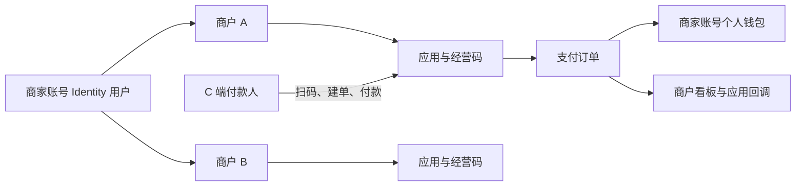

# MiniPay 商户 B 端融合业务逻辑说明 v5.0.0

## 1. 适用范围

本说明替代商户业务逻辑 v4.7.0 中与主线实现冲突的规则。目标是提供可接入应用、可收款、可退款、可追踪回调的商户支付能力；订单、钱包和身份仍由各自服务负责。

## 2. 领域关系与账户边界

- 一个商家账号可以拥有多个商户；一个商户可以有多个应用；每个应用有一条经营收款码。
- 商户不创建独立钱包。该账号旗下商户的收入和退款均落到该商家账号的个人钱包；订单、应用、看板必须按商户隔离。
- `merchant.owner_user_id` 只建立普通索引，不能设置唯一约束。

## 3. 入驻、状态与初始化

1. 商家提交入驻只创建 `merchant_apply`，不提前创建 PENDING 商户。
2. 运营审核通过后创建 ACTIVE 商户，并绑定申请人 `user_id`。同一账号、同一标准化店名只允许一个未结束申请。
3. REJECTED 和 SUPPLEMENT 可使用申请版本补充并重提；提交、审核、重提均记录审计。
4. ACTIVE 可编辑资料、应用、密钥与经营码；DISABLED/FROZEN 允许登录查看但不能新增收款。已发生订单仍可退款。
5. 每个商户首次初始化以商户行锁和 `default_application_id` 防并发：创建一个默认应用和默认经营码，不会重复创建。

## 4. 账号安全

- 商户密码是商家账号密码，归 Identity 管理，多个商户共用一次登录；不允许 Payment 反向校验密码。
- 密码使用 Argon2id；连续 5 次失败锁定 10 分钟。短信登录、忘记密码和换绑后的密码重置均由 Identity 的受信验证后签发商户 OAuth。
- 商户 B 端和运营端使用独立 token/session；商户退出仅清理商户会话。

## 5. 应用、密钥与收款码

- 默认应用可直接由初始化创建；新增应用沿用运营审批，审批后处于 DISABLED，商户配置完成后启用。
- 应用保存加密后的密钥、支付/退款通知地址、权限、IP 白名单和可用渠道。密钥只能通过一次性查看接口领取；遗失后只能重置，查看与重置均审计。
- 经营码内容为 `minipay://collect/merchant?token=<随机 token>`。每应用仅一条，可启停、换码；换码以 version 乐观锁完成，旧 token 立即失效。
- 扫码响应只提供商户展示信息、appId、渠道和一次性 `resolutionId`，不暴露金额、店主用户 ID、AppSecret。

## 6. 支付、退款、看板与钱包

1. C 端调用扫码解析，再用 `resolutionId` 建单。Payment 原子消费凭证，从服务端写入 `merchant_id`、`application_id`、`app_id` 和平台 `merchant_order_no`，忽略客户端伪造归属。
2. 余额支付原子扣付款人、加店主；外部渠道从沙箱结算账户记入店主。退款原子扣店主、退付款人；店主可用余额不足时失败且不产生半笔账。
3. 商户端订单页只展示本商户订单，支持详情、筛选、分页和全额退款入口，不重复实现订单状态机。
4. 钱包页只读展示当前登录商家账号的钱包总额、可用/冻结与账单，不新增商户钱包。
5. 看板使用 `merchant-metric` Inbox 消费成功支付和退款事件，按 Asia/Shanghai 统计今日、7/30 天和累计指标，并展示渠道占比与近期订单。

## 7. 回调与消息

- 事件 routing key 固定为 `payment.order.succeeded`、`payment.refund.succeeded`；兼容原字段并追加 merchantId/appId/merchantOrderNo/paymentOrderNo/refundNo/paymentMethod。
- 支付通知投递 `notifyUrl`，退款通知投递 `refundNotifyUrl`。HMAC-SHA256 使用应用密钥，支付与退款各自使用固定签名串。
- `merchant-notification` Inbox 负责去重与投递；首次发送后最多自动重试 10 次并指数退避，人工重试不会重置历史计数；只持久化状态码和响应摘要，不保存敏感响应全文。
- 本地 `callback-mock` 用于验证签名、幂等、500、超时和人工重试，不属于生产依赖。

## 8. 租户与兼容原则

- 所有 `/api/v1/merchant/merchants/{merchantId}/...` 请求先验证 JWT 用户确实拥有目标商户，跨商户访问返回无权访问。
- 订单、钱包、Identity、运营端保持原有职责和现有接口；本次仅追加商户资金闭环所需的向后兼容字段、内部能力和运营审批能力。
